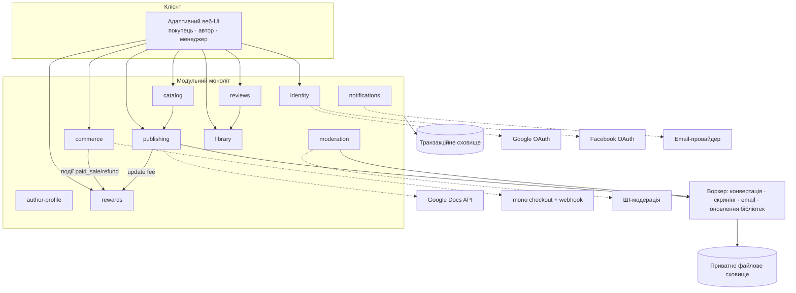

# Architecture

## Source References

- `docs/prd.md` — функціональні драйвери (FR-*), NFR, припущення A-1..A-4.
- `docs/product-idea.md` — авторитетне джерело наміру (PRD прямо посилається).
- `docs/project-context.md` — спожито: розд. 7 (platform), 9–11 (межі/обмеження), 13 (ризики).
- `docs/canonical-terms.md` — ідентифікатори сутностей.
- `docs/guardrails.md` — заборонені зміни, правила доказовості.
- `docs/user-journey.md`, `docs/screen-map.md`, `docs/wireframes.md`, `docs/design-brief.md` — поверхні, стани, навігаційна модель та Approved Baseline `AVB-UKIEBOOK-AURORA-7B-V3` (UI-межі).
- `forge/design/README.md` і `forge/design/candidates/operator-final-7b/v3/README.md` — React + TypeScript recommendation, visual-reference-not-production-code constraint та immutable V3 correction target.
- `package.json`, `app/`, `components/aurora/`, `modules/platform/`, `db/`, `workers/`, `scripts/` і `tests/` — реалізований UNIT-00 foundation at revision `f6e503b242d5a5eca59972dece1657f4d207b3e3`; canonical verification evidence: `forge/runs/UNIT-00/20260721T202102Z-f6e503b242d5/`.
- `app/login/`, `app/api/auth/`, `app/author/profile/`, `components/identity/`, `modules/identity/`, `modules/author-profile/`, `modules/payout-details/`, migration `0002_identity_sessions_author_profile`, `scripts/verify-unit01-postgres.ts` і UNIT-01 tests — реалізований identity/profile slice at revision `ab030a00f213d33f62783f0287dd8e5dcfe67101`; canonical evidence: `forge/runs/UNIT-01/20260721T221049Z-ab030a00f213/`. Доказ покриває S-03, S-17 і access guards у межах UNIT-01, включно з виміряними AA control contrast і ≥44px interactive targets; live consent у зареєстрованих production apps Google/Facebook лишається окремим activation gate і не позначений як passed.
- `app/page.tsx`, `app/books/[id]/`, `components/catalog/`, `modules/catalog/`, migration `0003_catalog_read_model`, production brand/Cover assets, `scripts/verify-unit02-postgres.ts` і UNIT-02 tests — original public catalog/Book Page slice at revision `a441ab415d2818872599f01efae856acebf75b42`; canonical historical evidence: `forge/runs/UNIT-02/20260722T011333Z-a441ab415d28/`. Its V2 visual receipt is superseded, while its catalog behavior remains implementation history.
- UNIT-02-C1 at revision `3f77594bcb615847bdd71846374184cd2070d305`; canonical correction evidence `forge/runs/UNIT-02-C1/20260722T115720Z-338d4450e107/run.json` — active S-01 visual correction against `AVB-UKIEBOOK-AURORA-7B-V3`: transparent SVG logo, square-corner covers, seven unique baked-artwork assets, uncropped shelf, exact hero copy and `35/65` ribbon. This correction changes presentation/configured percentage truth, not the catalog module boundary.
- `app/author/books/`, `app/author/publish/`, `app/api/author/publishing/`, `components/publishing/`, `modules/publishing/`, migration `0004_publishing_pipeline`, UNIT-03 verifier and tests — completed publishing/conversion slice at revision `6fb52daf3ff11630454c13a76adfd7875c749e8f`; canonical evidence `forge/runs/UNIT-03/20260722T151115Z-6fb52daf3ff1/run.json`. The evidence covers S-10/S-11/S-12 through immutable `BookVersion` + `BookSubmitted`, real DOCX/TXT/bounded Google Docs conversion to validated EPUB and legacy MOBI, private local-storage proof behind the production object-storage port, retry/draft preservation, and the Aurora Author extension. It does not cover Manual Review, publication activation or the public catalog projection; those begin in UNIT-04, the next executable unit.

## Architecture Overview

UkieBook — адаптивний вебзастосунок із трьома ролевими поверхнями (Покупець, Автор, Менеджер) над спільним ядром. Архітектурні драйвери: (1) конвеєр перетворення Рукопису в EPUB/MOBI з обов'язковим Попереднім переглядом видання; (2) комерція із зовнішньою оплатою mono та точним обліком Оплачених продажів; (3) прозорий фінансовий лідж Нарахувань за поточною робочою формулою; (4) двоступенева модерація (ШІ → Ручна перевірка); (5) сувора сепарація даних.

Форма: модульний моноліт із явними межами модулів і асинхронним воркером для важких/фонових задач. Це найпростіша архітектура, що задовольняє PRD; межі модулів — міграційні шви на випадок майбутнього виділення сервісів.

## Architecture Principles

1. Найпростіше, що задовольняє PRD; жодної інфраструктури «на виріст» без джерела.
2. Гроші — лише через незмінюваний лідж подій; жодних перерахунків «на льоту» без сліду (FR-REW, FR-PYT, guardrails: доказ перед твердженням).
3. Платіжні дані карток не торкаються платформи — вся PCI-поверхня в mono (FR-PAY-3).
4. Кожен модуль володіє своїми даними; міжмодульний доступ — через явні інтерфейси.
5. Довгі операції (конвертація, модерація, email) — асинхронні з видимими станами (screen-map: стани завантаження/помилок).
6. Ролі й межі маршрутів — точно за Navigation Model зі screen-map; жодних прихованих адмін-шляхів.

## System Context

Актори: Гість, Покупець, Автор, Менеджер (canonical-terms). Зовнішні системи: Google OAuth, Facebook OAuth, інтеграція імпорту Google Docs, mono (plata by mono), email-провайдер, ШІ-модераційний сервіс. Межі походять із project-context розд. 7/9; Google Docs API є adapter-рішенням цієї архітектури, а не новою продуктовою вимогою.

## Module And Boundary Map

| Модуль | Володіє | Обслуговує екрани |
|---|---|---|
| `identity` | Користувачі, OAuth-звʼязки й одноразові flows, явні ролі, hashed sessions, append-only identity audit | S-03; guard-и всіх `/author/*`, `/admin/*`, `/library` |
| `author-profile` | Лише публічне імʼя/псевдонім; public DTO не містить OAuth email чи платіжних полів | S-17 |
| `payout-details` | Закритий encrypted envelope договірних/платіжних/податкових даних; зміст і UI належать UNIT-07 | S-16 |
| `publishing` | Рукописи, private-object metadata, конвеєр конвертації, Обкладинки, immutable версії Книжки, артефакти Попереднього перегляду видання, Безкоштовний фрагмент і окремі Декларації прав/ліцензії. UNIT-03 реалізує S-10/S-11/S-12 до `BookSubmitted`; S-13/S-14 lifecycle states лишаються наступним owning scope. | S-10..S-14 |
| `catalog` | Публічна additive read projection опублікованих книжок: жанри, featured slots, пошук/фільтри/стабільне сортування/пагінація, integer-kopiyka ціни й dated Discount, безкоштовні фрагменти та опубліковані відгуки; DTO не читають приватні publishing/identity поля. Presentation contract renders Book Covers 2:3 with square corners and never synthesizes live title overlays on cover artwork. | S-01, S-02 |
| `moderation` | Модераційні кейси (книжка/оновлення/відгук), сигнали ШІ, рішення, категорії причин | S-18; статуси в S-08/S-10/S-13 |
| `commerce` | Кошик, замовлення, платіжні сесії mono, вебхуки, повернення | S-04..S-06, S-09, S-20 |
| `library` | Права доступу покупця до куплених книжок, видача файлів, версійність після оновлень | S-07 |
| `reviews` | Рейтинги й відгуки з привʼязкою до підтвердженої покупки | S-08, блок відгуків S-02 |
| `rewards` | Лідж нарахувань, утримання 250 грн, місячні payout-рядки, статуси виплат, перемикач засновника | S-15, S-19, S-21 |
| `notifications` | Email після покупки (E-01) | — |

Правила меж: `catalog` читає з `publishing` лише опубліковані версії; `rewards` слухає події `commerce` (оплата/повернення) і `publishing` (платне оновлення), але не пише в них; `reviews` перевіряє покупку через інтерфейс `library`; ПД покупців не перетинають межу `rewards`-звітів автора (FR-REW-6).

## Runtime And Automation Model

- Веб-процес: синхронні запити UI + API.
- Воркер асинхронних задач: реалізована UNIT-03 конвертація рукопису (DOCX/TXT/bounded Google Docs export → нормалізація FR-PUB-2 → адаптивне видання → EPUB/legacy MOBI) і збереження `PreviewArtifact`; publishing service окремо зберігає fallback/upload Cover. Наступні юніти додають ШІ-скринінг модерації, email і застосування схваленого оновлення до бібліотек покупців (FR-UPD-3).
- Вебхук-приймач mono: підтвердження оплати → подія `paid_sale`; скасування/повернення → компенсаційна подія (FR-PAY-5, FR-REF-3).
- Планувальник: щомісячна побудова payout-таблиці (рядок автор×місяць, FR-PYT-2) з ліджа; застосування переносів <100 грн (FR-PYT-4) і утримань 250 грн (FR-UPD-2).
- Ручні дії менеджера (схвалення модерації, підтвердження виплати, рішення щодо повернення) — синхронні транзакції з аудит-слідом.

## Data And State Model

Ключові сутності (ідентифікатори — canonical-terms):

- `user` → explicit `user_role` assignments + `oauth_account` provider mapping + hashed `session`; `oauth_flow` одноразово тримає зашифровані PKCE/nonce та server-held author-onboarding intent; `identity_audit_event` є append-only. OAuth email не використовується для автоматичного злиття облікових записів.
- `author_profile` містить лише публічне імʼя; закритий `author_payout_details` уже має окрему encrypted-envelope межу (`schema_version`, `key_id`, nonce, ciphertext, authentication tag), але модель винагороди ФОП/роялті та S-16 реалізує UNIT-07 (FR-AUTH-3/4).
- `book_draft` володіє revision-guarded editable metadata, current private Manuscript/Cover/Illustration links, conversion status/result, current `PreviewArtifact` і `sample_preview_artifact_id`. Submission requires the sample to reference that same completed preview artifact, freezes one immutable `book_version`, writes separate rights/license declarations and emits one versioned `BookSubmitted` outbox event. UNIT-03 stops there: moderation status, publication activation, public `catalog_book_read_model` mutation and the one-active-published-version rule are UNIT-04 scope; `discount` remains UNIT-08 scope.
- Публічний `catalog_book_read_model` є окремою projection-моделлю для S-01/S-02, а не джерелом приватного publishing state. Він зберігає лише public Author identity, жанр, опис/sample, Cover reference, availability, рейтинг і integer-kopiyka price presentation; активний Discount має напіввідкритий інтервал `[starts_at, ends_at)`. `catalog_featured_slot` і `catalog_review_read_model` мають детермінований порядок. Cover reference points to finished artwork; accessible title remains semantic data outside the pixels, while the rendered cover image has no live-text overlay. UNIT-02 fixture seed явно підтверджується й заборонений у production; наступні owning units оновлюють projection через versioned catalog-publisher boundary (AD-11).
- `rights_declaration` — привʼязана до подання версії (FR-PUB-8).
- `moderation_case` — тип (книжка/оновлення/відгук), сигнал ШІ, рішення, `reason_category` (FR-MOD-*).
- `cart` → `order` → `payment_session` (mono) → події `paid_sale` / `refund` (FR-PAY-5, FR-REF-3).
- `library_item` — покупець×книжка, посилання на актуальну версію файлів (FR-LIB-1/3).
- `review` — покупець×книжка, рейтинг, текст, статус модерації (FR-REV-1/2).
- Лідж `accrual`: незмінювані події +65% від фактично сплаченої ціни (`paid_sale`), −65% (повернення), −250 грн (`book_update` fee, з чергою очікування накопичення), окремий override засновника 100% (FR-FND-2). Стандартна allocation rule зберігає exact basis points: `platform_net_revenue_bps=2900`, `platform_tax_component_bps=600`, `author_share_bps=6500`; публічне `platform_share_bps=3500` є сумою перших двох. Інваріанти: `2900 + 600 = 3500`, `3500 + 6500 = 10000`. Похідне: `payout_row` (автор×місяць): сума продажів, чистий заробіток платформи 29%, податковий компонент платформи 6%, частка автора 65%, сума до виплати, статус (очікує/підтверджено/виплачено/перенесено) — FR-PYT-2/4. Founder override маркується окремо й не підміняє standard invariant.

Стан у UI: стани екранів — власність screen-map; сервер — джерело істини для статусів модерації, платежів і виплат; клієнт лише відображає.

## Integration Map

| Інтеграція | Напрям | Контракт | Помилковий шлях |
|---|---|---|---|
| Google OAuth / Facebook OAuth | вихідний redirect + callback | authorization code + PKCE S256; Google OIDC додатково перевіряє nonce, JWKS-підпис, issuer/audience/subject і збіг `userinfo.sub`; звʼязування лише за provider+subject; provider tokens після перевірки не зберігаються | відмова/помилка/повтор callback → S-03 з контрольованим кодом; flow одноразовий, failure audit append-only |
| Google Docs API | вихідний | імпорт документа за наданим автором доступом | помилка формату → dropzone S-11 |
| mono (plata by mono) | redirect на checkout (дефолт OQ-SM1) + вхідний вебхук | створення платіжної сесії кошика; підтвердження/скасування вебхуком; ідемпотентна обробка | невдача → S-06 failure, кошик збережено |
| Email-провайдер | вихідний | транзакційний лист E-01 (перелік книжок + лінк бібліотеки) | ретраї воркера; недоставка не блокує доступ до бібліотеки |
| ШІ-модерація | вихідний | скринінг контенту на категорії FR-MOD-1; результат = сигнал, не вирок | недоступність сервісу → кейс у ручну чергу (safe-fail) |

## Technology Stack And Constraints

Найменший reversible stack, що задовольняє джерела й фінальний handoff:

- **Repository/runtime:** один TypeScript repository; pinned Node `24.16.0` development toolchain with runtime floor `>=20.17.0`, npm `11.13.0`, Next.js `16.2.11`, React `19.2.8` and TypeScript `6.0.3`; Next.js App Router для SSR public catalog, React UI, server routes/actions for synchronous API, окремі Node.js worker/scheduler processes у тому самому modular-monolith codebase. `package.json`, `.node-version` і lockfile є implementation source of truth для точних версій.
- **Frontend:** CSS custom properties + CSS Modules/vanilla authored CSS; жодна generic UI library не може підмінити Aurora 7b. Shared accessible primitives wrap semantic controls without changing Baseline geometry.
- **Persistence:** PostgreSQL; committed reversible migrations with advisory-lock serialization and checksum verification; explicit transactions behind an inward SQL port. PGlite is test-only and never substitutes for the real-PostgreSQL acceptance proof. Monetary values stored only as integer kopiykas; percentage model stored as exact basis points/rules (`2900 + 600 + 6500 = 10000`; `platform_share_bps = 3500`), never binary floating point.
- **Async/durability:** PostgreSQL-backed durable job table/queue + worker, transactional outbox from domain transactions, semantic idempotency conflict detection, lease renewal/loss cancellation, bounded retries and dead-letter state. Monthly payout generation is a scheduled job using the same mechanism.
- **Files:** domain code depends on `PrivateObjectStorage`; database holds metadata/hashes/version links. UNIT-03 proves private persistence and Author-scoped reads with `LocalPrivateObjectStorage` on the dedicated loopback PostgreSQL/evidence runtime. Production remains private S3-compatible object storage supplied through the same adapter/deployment boundary in UNIT-10; the local receipt is not an S3 deployment claim. Purchased-file delivery later uses short-lived signed/authorized downloads after `library_item` access checks.
- **Auth:** pinned `oauth4webapi` production adapters для Google/Facebook; authorization code + PKCE S256, Google OIDC nonce/JWKS verification; opaque 256-bit session/flow tokens, у PostgreSQL зберігаються лише SHA-256 digests; AES-GCM для server-held flow values; HMAC-bound CSRF; `HttpOnly`, `SameSite=Lax`, `Secure`/`__Host-` cookies для HTTPS; centralized explicit-capability guards; жодних auth/provider tokens у browser storage або OAuth-token columns.
- **Payments:** mono redirect checkout; signed/authenticated webhook verification per provider docs current at implementation time; unique provider event/session keys, idempotent transaction + outbox, scheduled reconciliation.
- **Email/AI:** provider adapters with local fakes; production provider selection does not cross domain interfaces. AI outage safe-fails to `manual_review_pending`.
- **Conversion:** isolated `EditionConverter` uses the proven `calibre-legacy-mobi-v1` adapter on Calibre `9.11.0` to produce normalized intermediate content, EPUB, legacy MOBI and a persisted `PreviewArtifact`. UNIT-03 validates outputs with `epub-container.v1` and `legacy-mobi-header.v1`, preserves inline Illustrations for DOCX/Google Docs, records meaning hashes, rejects stale jobs and exposes typed failure/retry without silently dropping MOBI.
- **Verification tooling:** Vitest `4.1.10` and Playwright `1.61.1`; stable commands `npm run build`, `npm run lint`, `npm run typecheck`, `npm test`, `npm run test:e2e`, `npm run test:visual` are executable. `npm run verify:unit00` and `npm run verify:unit01` retain their historical revision-bound evidence contracts. The active catalog verifier is `npm run verify:unit02c1`; `npm run verify:unit02` is a compatibility alias to the same correction command and cannot write into the immutable historical UNIT-02 namespace. UNIT-02-C1 uses the exact dedicated loopback database `ukiebook_unit02`, reproves reversible migration `0003`, guarded deterministic seed and public-read invariants, then runs S-01/S-02 behavior plus the V3 visual matrix and review-bound target comparison. It adds exact assertions for logo transparency, square radii, seven unique artwork sources, shelf no-clipping, hero copy and `35/65`; its frozen run is `forge/runs/UNIT-02-C1/20260722T115720Z-338d4450e107/run.json`. `npm run verify:unit03` is the revision-bound publishing bundle: it guards dedicated loopback database `ukiebook_unit03`, reproves migration `0004`, real conversion/private-artifact/domain invariants, 3/3 Author E2E scenarios, 30 visual screenshots and 7 accessibility receipts; canonical run `forge/runs/UNIT-03/20260722T151115Z-6fb52daf3ff1/run.json` records 105 passed/2 skipped tests and `npm audit --audit-level=high` with zero vulnerabilities.
- **Deployment topology:** three process roles from one revision — web, worker, scheduler — plus managed PostgreSQL and private object storage. Environments use injected secrets/config; secrets never enter Git or client bundles. Hosting vendor remains replaceable.
- **Card data:** never stored or processed by UkieBook; mono owns payment entry surface.

## Security Privacy And Access Model

- RBAC: `buyer`, `author`, `manager` — окремі явні ролі/capabilities без порядку успадкування; роль Автора надається лише атомарно зі збереженням першого S-17, після чого всі попередні сесії відкликаються й видається replacement session; guard-и маршрутів відповідають Navigation Model.
- OAuth boundary: safe `returnTo` allow-list не допускає зовнішні/службові маршрути; flow claim одноразовий; provider mapping не auto-links за email; forged Google signature, wrong nonce і `userinfo.sub` mismatch fail closed без створення user/account/session.
- Сепарація даних: `author_payout_details` — закритий encrypted-envelope піддомен; public `AuthorProfile` повертає лише `authorId` і `publicName`; ПД покупців ніколи не потрапляють у авторські звіти (FR-REW-6); статус засновника невидимий у авторських поверхнях (FR-FND-3).
- Платежі: платформа тримає лише ідентифікатори сесій mono і результати; карткові дані — ні (FR-PAY-3).
- Файли книжок: видача лише автентифікованому власнику `library_item`; посилання — короткоживучі/авторизовані.
- Внутрішні правила модерації — лише в закритому контурі `moderation`; назовні — `reason_category` (FR-MOD-3).
- Аудит-слід: рішення менеджера (модерація, виплати, повернення, перемикач засновника) фіксуються з часом і актором.
- Webhook secrets, OAuth secrets, database/object-storage credentials and email/AI keys are server-only injected secrets; logs redact tokens and personal fields.
- Same-origin + CSRF перевірки захищають mutation boundaries; недійсна S-17 мутація повертає privacy-safe form error, тоді як auth/RBAC/persistence failures не маскуються як validation success.
- UNIT-03 upload endpoints stream bounded multipart bodies with declared-size overhead and actual file-size enforcement; the Google Docs JSON endpoint is also body-bounded before parsing. Private objects are resolved through Author ownership, never exposed by a public object URL.
- Enabling a new Автор-засновник is one transaction that clears any prior singleton assignment, writes the new assignment and audit event, or changes nothing on failure.

## Performance Reliability And Observability

- Конвертація — асинхронна з явними станами й bounded retry; UNIT-03 proves `conversion_failed` → retry → `ready` on the same draft without data loss, rejects stale jobs, and binds sample selection to the completed current `PreviewArtifact` before submission.
- Вебхуки mono — ідемпотентні; втрачений вебхук компенсується звіркою статусу сесії.
- Лідж — append-only: будь-яка сума в S-15/S-19 відтворюється з подій (доказовість guardrails).
- Базова спостережуваність: логи конвеєра конвертації, платіжних подій і модераційних рішень — мінімум для ручних процесів менеджера.
- Every job and webhook carries correlation/idempotency IDs; dead-letter jobs and reconciliation mismatches are visible to operations before payout generation.
- Каталог SSR виконує лише bounded public projection queries із deterministic tie-breaker, fixed page size та additive DTO contract; unavailable Book виключається із browse/search, але зберігає стабільну S-02 unavailable response без ціни чи sample.

## Architecture Diagram

## Architecture Decision Log

### AD-1 Модульний моноліт, не мікросервіси

- Source References: PRD (MVP із ручними процесами Менеджера), project-context розд. 13.
- Alternatives Considered: мікросервіси; безсерверні функції на кожен домен.
- Why This Direction: найменша складність, що задовольняє PRD; UNIT-00 implementation підтверджує, що web/worker/scheduler and PostgreSQL foundation can share one revision and inward contracts without distributed-service overhead.
- Consequences: межі модулів — дисципліна коду, не мережі; виділення сервісу в майбутньому — по швах модулів.

### AD-2 Незмінюваний лідж нарахувань + похідні payout-рядки

- Source References: FR-REW-2/3, FR-PYT-2/4, FR-UPD-2, FR-REF-3; guardrails (доказ перед твердженням).
- Alternatives Considered: зберігати лише агреговані баланси.
- Why This Direction: прозорість формули для автора і звіряність кожної суми; повернення й утримання — природні компенсаційні події.
- Consequences: більше подій у сховищі; будь-який звіт відтворюваний; помилки виправляються компенсаціями, не правками історії.

### AD-3 Оплата mono через redirect + ідемпотентний вебхук

- Source References: FR-PAY-3/5; OQ-SM1 (дефолт redirect); journey Failure Path.
- Alternatives Considered: вбудований віджет mono.
- Why This Direction: найменша інтеграційна поверхня і нульова PCI-зона платформи; віджет — зворотна заміна пізніше.
- Consequences: покупець тимчасово покидає сайт; потрібна надійна обробка повернення і звірка сесій.

### AD-4 Конвертація як асинхронний конвеєр із артефактом Попереднього перегляду видання

- Source References: FR-PUB-2/6/7; стани S-11/S-12 (помилка конвертації); project-context розд. 13 (головний технічний ризик).
- Alternatives Considered: синхронна конвертація в запиті.
- Why This Direction: DOCX/GDocs непередбачувані за часом; асинхронність дає чесні стани прогресу й помилок.
- Consequences: потрібен воркер і статусна модель версії Книжки; `PreviewArtifact` — окремий збережений артефакт до подання.
- Implementation Evidence: UNIT-03 revision `6fb52daf3ff11630454c13a76adfd7875c749e8f` proves the worker/job path, persisted preview, stale-job guard, failure/retry recovery and immutable submission boundary in `forge/runs/UNIT-03/20260722T151115Z-6fb52daf3ff1/run.json`.

### AD-5 ШІ-модерація як замінний зовнішній сервіс із safe-fail у ручну чергу

- Source References: FR-MOD-1/2; project-context розд. 9/13.
- Alternatives Considered: вбудована модель; блокування публікацій при недоступності ШІ.
- Why This Direction: провайдер не зафіксований джерелами; сигнал ШІ — вхід для людини, тож деградація в ручну чергу зберігає безпеку без зупинки платформи.
- Consequences: інтерфейс скринінгу абстрактний; вибір провайдера — відкрите питання без зміни меж.

### AD-6 TypeScript modular monolith: Next.js web + separate Node worker

- Decision: один TypeScript codebase із Next.js/React SSR web-процесом і окремим worker/scheduler runtime.
- Source References: A-1 adaptive web; public catalog needs indexable server-rendered pages; `forge/design/README.md` recommends React + TypeScript; AD-1 modular monolith.
- Alternatives Considered: SPA + separate API; multiple services; serverless-only functions.
- Why This Direction: найменше дублювання contracts/types, SSR для Каталогу, clear isolation for long-running conversion/jobs.
- Consequences: web and worker deploy separately from the same revision; shared domain modules cannot import UI/runtime adapters inward.

### AD-7 PostgreSQL ledger/outbox/job backbone

- Decision: PostgreSQL owns transactional domain state, append-only Нарахування, outbox and durable jobs; money is integer kopiykas.
- Source References: FR-PAY-5, FR-REW-2/3, FR-PYT; AD-2; reliability needs.
- Alternatives Considered: document database; in-memory queue; floating-point money; external queue before product scale requires it.
- Why This Direction: one ACID boundary prevents payment/ledger/event divergence and remains simplest for MVP.
- Consequences: migrations and transaction boundaries are first-class; worker claims jobs atomically; future external queue migration keeps outbox contract.

### AD-8 Aurora-first frontend primitives, not prototype promotion

- Decision: reimplement approved Baseline in semantic React components and CSS tokens; `forge/design/candidates/operator-final-7b/v3/ukiebook-catalog.html` is an immutable visual target and is not copied as production application code.
- Source References: Approved Baseline `AVB-UKIEBOOK-AURORA-7B-V3`, target bundle hash `e50c9f82c241195d7f5d8876d9dcdcd7fd45b71cdaf6d2eedfe2e327a7182724`; handoff About the Design Files; guardrails Evidence Requirements.
- Alternatives Considered: direct HTML copy; generic component library defaults; image-to-code promotion.
- Why This Direction: exact visual target and production semantics/states can coexist without inheriting demo-only div/span controls or non-responsive CSS.
- Consequences: `Prototype Reuse: none`; visual diffs use the V3 target bundle (HTML + candidate-local covers + authoritative transparent-background SVG logo), while functionality is implemented independently and proven by runtime gates. Every rendered Book Cover remains square-cornered; cover titles in pixels come from artwork assets, never a live overlay.

### AD-9 Private versioned artifacts and authorized delivery

- Decision: Рукопис, `PreviewArtifact`, EPUB/MOBI та Обкладинки зберігаються як immutable/versioned private objects із database hashes; завантаження потребує чинної авторизації.
- Source References: FR-PUB-6/7, FR-LIB-1..3, NFR-3; project-context privacy constraints.
- Alternatives Considered: public permanent URLs; database blobs; mutable file overwrite.
- Why This Direction: prevents cross-buyer access and makes approved updates reproducible without destroying prior artifacts.
- Consequences: object lifecycle/retention is explicit; signed URLs are short-lived; `library_item` resolves the active approved `book_version`. UNIT-03 proves the port and private local adapter, object hashes/version links and Author-only access; production S3-compatible adapter/deployment and purchased-file delivery remain UNIT-10/UNIT-06 respectively.

### AD-10 Server-owned OAuth identity with explicit roles and rotated opaque sessions

- Decision: Google/Facebook callbacks завершують одноразовий server-owned flow; provider+subject є єдиним ключем OAuth-звʼязку, ролі перевіряються як окремі capabilities, а зміна authorization state відкликає старі hashed sessions і видає нову opaque session.
- Source References: FR-AUTH-1..3, S-03/S-17, NFR-3; UNIT-01 implementation/evidence at `ab030a00f213d33f62783f0287dd8e5dcfe67101`.
- Alternatives Considered: JWT у browser storage; auto-link за email; role hierarchy; роль Автора одразу після OAuth.
- Why This Direction: не довіряє mutable email як identity key, мінімізує browser secret surface, не підвищує first-time user до Автора до валідного S-17 і робить authorization change негайно відкличним.
- Consequences: потрібні persistent flow/session tables, centralized guards, CSRF/Origin checks і credentialed smoke перед production activation кожного provider app.

### AD-11 Public catalog projection isolates browse reads from private publishing state

- Decision: S-01/S-02 читають із PostgreSQL projection tables owned by `catalog`; `BookCatalogReadModel`, `BookPageReadModel`, `CatalogQuery` and `PricePresentation` are additive public contracts. The projection stores integer-kopiyka prices, half-open Discount windows and only public Author fields. UNIT-02 bootstrap data enters only through an explicitly acknowledged, production-rejected deterministic seed; later publication/moderation units update the same boundary rather than writing catalog tables ad hoc.
- Source References: FR-CAT-1..4; NFR-3; UNIT-02 `CatalogQuery`/repository/migration contracts and canonical evidence at `a441ab415d2818872599f01efae856acebf75b42`.
- Alternatives Considered: query private publishing/identity tables directly from SSR; client-side fixture catalog; expose one broad Book aggregate to every surface.
- Why This Direction: public discovery needs stable, indexable, privacy-minimized reads while publishing versions and moderation state evolve independently. The bounded projection keeps unavailable/private fields out by construction and makes search/filter/sort/pagination behavior reproducible.
- Consequences: catalog publication is eventually driven by an explicit versioned publisher/event boundary; projection lag must be observable; read DTO changes are additive; fixture seed is never a production publication path.

## Risks And Mitigations

| Ризик | Джерело | Мітигація |
|---|---|---|
| Якість конвертації DOCX/GDocs з Ілюстраціями | project-context розд. 13 | Обовʼязковий Попередній перегляд видання (FR-PUB-6); асинхронний конвеєр з чесними помилками; рання fixture-перевірка реальних Рукописів |
| Регресія legacy MOBI при зміні Calibre/toolchain | FR-PUB-7 | UNIT-03 closes the engine choice with pinned Calibre `9.11.0`, adapter `calibre-legacy-mobi-v1`, representative fixtures and `legacy-mobi-header.v1`; any converter/runtime change reruns the full conversion proof |
| Розбіжність вебхуків mono і фактичних оплат | FR-PAY-5 | Ідемпотентність + періодична звірка сесій |
| Помилки в ручних виплатах | FR-PYT | Лідж як єдине джерело сум; payout-рядки — похідні; аудит-слід підтверджень |
| Витік ПД через звіти | FR-REW-6, NFR-3 | Сепарація доменів даних; звіти автора будуються без полів покупця |
| Розбіжність локально перевіреного OAuth adapter contract із production app/redirect registration | FR-AUTH-1, NFR-3 | Loopback protocol simulator + негативні OIDC-вектори в CI; credentialed Google/Facebook consent smoke є обовʼязковим activation gate |

## Out Of Scope

Внутрішня читалка; нативні застосунки; мультивалютність/мультимовність; автоматичні виплати без менеджера; DRM (джерела не вимагають — файли видаються покупцеві напряму).

## Open Questions

- OQ-AR1 closed: TypeScript + Next.js/React web + separate Node worker in one modular-monolith repository (AD-6).
- OQ-AR2 closed: PostgreSQL with transactional ledger/outbox/jobs and integer-kopiyka money (AD-7).
- OQ-AR3 closed by UNIT-03: Calibre `9.11.0` through `calibre-legacy-mobi-v1` produced validated EPUB (`epub-container.v1`) and legacy MOBI (`legacy-mobi-header.v1`) from representative DOCX/TXT/bounded Google Docs fixtures, including inline Illustrations where applicable; canonical proof is `forge/runs/UNIT-03/20260722T151115Z-6fb52daf3ff1/run.json`.
- OQ-AR4. Production email and ШІ-модерація providers remain adapter selections; local fake contracts are mandatory, provider choice is not an architecture blocker.
- OQ-AR5 closed at topology level: web + worker + scheduler + managed PostgreSQL + private object storage; vendor choice remains operational and replaceable.
