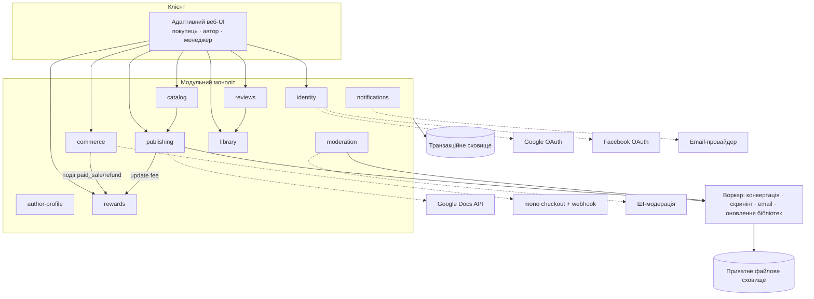

# Architecture

## Source References

- `docs/prd.md` — функціональні драйвери (FR-*), NFR, припущення A-1..A-4.
- `docs/product-idea.md` — авторитетне джерело наміру (PRD прямо посилається).
- `docs/project-context.md` — спожито: розд. 7 (platform), 9–11 (межі/обмеження), 13 (ризики).
- `docs/canonical-terms.md` — ідентифікатори сутностей.
- `docs/guardrails.md` — заборонені зміни, правила доказовості.
- `docs/user-journey.md`, `docs/screen-map.md`, `docs/wireframes.md`, `docs/design-brief.md` — поверхні, стани, навігаційна модель та Approved Baseline `AVB-UKIEBOOK-AURORA-7B-V2` (UI-межі).
- `forge/design/README.md` і `forge/design/candidates/operator-final-7b/v2/README.md` — React + TypeScript recommendation, visual-reference-not-production-code constraint та immutable V2 target з інтегрованим офіційним логотипом.
- `package.json`, `app/`, `components/aurora/`, `modules/platform/`, `db/`, `workers/`, `scripts/` і `tests/` — реалізований UNIT-00 foundation at revision `f6e503b242d5a5eca59972dece1657f4d207b3e3`; canonical verification evidence: `forge/runs/UNIT-00/20260721T202102Z-f6e503b242d5/`. Це implementation evidence для platform foundation, не доказ реалізації продуктових модулів або S-01…S-21.

## Architecture Overview

UkieBook — адаптивний вебзастосунок із трьома ролевими поверхнями (Покупець, Автор, Менеджер) над спільним ядром. Архітектурні драйвери: (1) конвеєр перетворення Рукопису в EPUB/MOBI з обов'язковим Попереднім переглядом видання; (2) комерція із зовнішньою оплатою mono та точним обліком Оплачених продажів; (3) прозорий фінансовий лідж Нарахувань за поточною робочою формулою; (4) двоступенева модерація (ШІ → Ручна перевірка); (5) сувора сепарація даних.

Форма: модульний моноліт із явними межами модулів і асинхронним воркером для важких/фонових задач. Це найпростіша архітектура, що задовольняє PRD; межі модулів — міграційні шви на випадок майбутнього виділення сервісів.

## Architecture Principles

1. Найпростіше, що задовольняє PRD; жодної інфраструктури «на виріст» без джерела.
2. Гроші — лише через незмінюваний лідж подій; жодних перерахунків «на льоту» без сліду (FR-REW, FR-PYT, guardrails: доказ перед твердженням).
3. Платіжні дані карток не торкаються платформи — вся PCI-поверхня в mono (FR-PAY-3).
4. Кожен модуль володіє своїми даними; міжмодульний доступ — через явні інтерфейси.
5. Довгі операції (конвертація, модерація, email) — асинхронні з видимими станами (screen-map: стани завантаження/помилок).
6. Ролі й межі маршрутів — точно за Navigation Model зі screen-map; жодних прихованих адмін-шляхів.

## System Context

Актори: Гість, Покупець, Автор, Менеджер (canonical-terms). Зовнішні системи: Google OAuth, Facebook OAuth, інтеграція імпорту Google Docs, mono (plata by mono), email-провайдер, ШІ-модераційний сервіс. Межі походять із project-context розд. 7/9; Google Docs API є adapter-рішенням цієї архітектури, а не новою продуктовою вимогою.

## Module And Boundary Map

| Модуль | Володіє | Обслуговує екрани |
|---|---|---|
| `identity` | Користувачі, OAuth-звʼязки, ролі, сесії | S-03; guard-и всіх `/author/*`, `/admin/*`, `/library` |
| `author-profile` | Публічне імʼя/псевдонім; окремо — договірні/платіжні/податкові дані (закритий піддомен `payout-details`) | S-16, S-17 |
| `publishing` | Рукописи, конвеєр конвертації, Обкладинки, версії Книжки, артефакти Попереднього перегляду видання, Декларації прав | S-10..S-14 |
| `catalog` | Опубліковані книжки, жанри, пошук/фільтри, знижки, безкоштовні фрагменти | S-01, S-02 |
| `moderation` | Модераційні кейси (книжка/оновлення/відгук), сигнали ШІ, рішення, категорії причин | S-18; статуси в S-08/S-10/S-13 |
| `commerce` | Кошик, замовлення, платіжні сесії mono, вебхуки, повернення | S-04..S-06, S-09, S-20 |
| `library` | Права доступу покупця до куплених книжок, видача файлів, версійність після оновлень | S-07 |
| `reviews` | Рейтинги й відгуки з привʼязкою до підтвердженої покупки | S-08, блок відгуків S-02 |
| `rewards` | Лідж нарахувань, утримання 250 грн, місячні payout-рядки, статуси виплат, перемикач засновника | S-15, S-19, S-21 |
| `notifications` | Email після покупки (E-01) | — |

Правила меж: `catalog` читає з `publishing` лише опубліковані версії; `rewards` слухає події `commerce` (оплата/повернення) і `publishing` (платне оновлення), але не пише в них; `reviews` перевіряє покупку через інтерфейс `library`; ПД покупців не перетинають межу `rewards`-звітів автора (FR-REW-6).

## Runtime And Automation Model

- Веб-процес: синхронні запити UI + API.
- Воркер асинхронних задач: конвертація рукопису (DOCX/TXT/GDocs → нормалізація FR-PUB-2 → адаптивне видання → EPUB/MOBI), генерація обкладинки, ШІ-скринінг модерації, надсилання email, застосування схваленого оновлення до бібліотек покупців (FR-UPD-3).
- Вебхук-приймач mono: підтвердження оплати → подія `paid_sale`; скасування/повернення → компенсаційна подія (FR-PAY-5, FR-REF-3).
- Планувальник: щомісячна побудова payout-таблиці (рядок автор×місяць, FR-PYT-2) з ліджа; застосування переносів <100 грн (FR-PYT-4) і утримань 250 грн (FR-UPD-2).
- Ручні дії менеджера (схвалення модерації, підтвердження виплати, рішення щодо повернення) — синхронні транзакції з аудит-слідом.

## Data And State Model

Ключові сутності (ідентифікатори — canonical-terms):

- `user` (роль/ролі) → `author_profile` (публічне імʼя) + закритий `payout_details` (модель винагороди ФОП/роялті, договірні/платіжні/податкові дані; FR-AUTH-3/4).
- `book` → `book_version` (рукопис, ілюстрації, обкладинка, результати конвертації EPUB/MOBI, статус модерації); активна опублікована версія — одна; `free_sample`, `genre`, базова ціна, `discount` (дати з-по).
- `rights_declaration` — привʼязана до подання версії (FR-PUB-8).
- `moderation_case` — тип (книжка/оновлення/відгук), сигнал ШІ, рішення, `reason_category` (FR-MOD-*).
- `cart` → `order` → `payment_session` (mono) → події `paid_sale` / `refund` (FR-PAY-5, FR-REF-3).
- `library_item` — покупець×книжка, посилання на актуальну версію файлів (FR-LIB-1/3).
- `review` — покупець×книжка, рейтинг, текст, статус модерації (FR-REV-1/2).
- Лідж `accrual`: незмінювані події +65,8% від сплаченої ціни (`paid_sale`), −65,8% (повернення), −250 грн (`book_update` fee, з чергою очікування накопичення), позначка засновника 100% (FR-FND-2). Похідне: `payout_row` (автор×місяць): сума продажів, % податків, % автора, сума до виплати, статус (очікує/підтверджено/виплачено/перенесено) — FR-PYT-2/4.

Стан у UI: стани екранів — власність screen-map; сервер — джерело істини для статусів модерації, платежів і виплат; клієнт лише відображає.

## Integration Map

| Інтеграція | Напрям | Контракт | Помилковий шлях |
|---|---|---|---|
| Google OAuth / Facebook OAuth | вихідний redirect + callback | стандартний OAuth 2.0; лише автентифікація й email/імʼя | помилка OAuth → S-03 інлайн (screen-map) |
| Google Docs API | вихідний | імпорт документа за наданим автором доступом | помилка формату → dropzone S-11 |
| mono (plata by mono) | redirect на checkout (дефолт OQ-SM1) + вхідний вебхук | створення платіжної сесії кошика; підтвердження/скасування вебхуком; ідемпотентна обробка | невдача → S-06 failure, кошик збережено |
| Email-провайдер | вихідний | транзакційний лист E-01 (перелік книжок + лінк бібліотеки) | ретраї воркера; недоставка не блокує доступ до бібліотеки |
| ШІ-модерація | вихідний | скринінг контенту на категорії FR-MOD-1; результат = сигнал, не вирок | недоступність сервісу → кейс у ручну чергу (safe-fail) |

## Technology Stack And Constraints

Найменший reversible stack, що задовольняє джерела й фінальний handoff:

- **Repository/runtime:** один TypeScript repository; pinned Node `24.16.0` development toolchain with runtime floor `>=20.17.0`, npm `11.13.0`, Next.js `16.2.11`, React `19.2.8` and TypeScript `6.0.3`; Next.js App Router для SSR public catalog, React UI, server routes/actions for synchronous API, окремі Node.js worker/scheduler processes у тому самому modular-monolith codebase. `package.json`, `.node-version` і lockfile є implementation source of truth для точних версій.
- **Frontend:** CSS custom properties + CSS Modules/vanilla authored CSS; жодна generic UI library не може підмінити Aurora 7b. Shared accessible primitives wrap semantic controls without changing Baseline geometry.
- **Persistence:** PostgreSQL; committed reversible migrations with advisory-lock serialization and checksum verification; explicit transactions behind an inward SQL port. PGlite is test-only and never substitutes for the real-PostgreSQL acceptance proof. Monetary values stored only as integer kopiykas; percentage model stored as exact basis points/rules (`600 + 6580 + 2820 = 10000`), never binary floating point.
- **Async/durability:** PostgreSQL-backed durable job table/queue + worker, transactional outbox from domain transactions, semantic idempotency conflict detection, lease renewal/loss cancellation, bounded retries and dead-letter state. Monthly payout generation is a scheduled job using the same mechanism.
- **Files:** private S3-compatible object storage; database holds metadata/hashes/version links; short-lived signed/authorized download after `library_item` access check.
- **Auth:** server-side OAuth sessions through Google/Facebook providers; persistent user/provider mapping; centralized RBAC guards for `/author/*`, `/admin/*`, `/library`; no auth tokens in browser storage.
- **Payments:** mono redirect checkout; signed/authenticated webhook verification per provider docs current at implementation time; unique provider event/session keys, idempotent transaction + outbox, scheduled reconciliation.
- **Email/AI:** provider adapters with local fakes; production provider selection does not cross domain interfaces. AI outage safe-fails to `manual_review_pending`.
- **Conversion:** isolated `EditionConverter` adapter produces normalized intermediate document, EPUB, MOBI and `PreviewArtifact`. A fixture-based enabler must prove the selected MOBI engine before the publishing unit; failure routes to upstream product decision rather than silently dropping MOBI.
- **Verification tooling:** Vitest `4.1.10` and Playwright `1.61.1`; stable commands `npm run build`, `npm run lint`, `npm run typecheck`, `npm test`, `npm run test:e2e`, `npm run test:visual` are executable. `npm run verify:unit00` writes the canonical revision-bound evidence bundle and requires a real PostgreSQL URL for the database proof.
- **Deployment topology:** three process roles from one revision — web, worker, scheduler — plus managed PostgreSQL and private object storage. Environments use injected secrets/config; secrets never enter Git or client bundles. Hosting vendor remains replaceable.
- **Card data:** never stored or processed by UkieBook; mono owns payment entry surface.

## Security Privacy And Access Model

- RBAC: guest < buyer < author; manager — окрема роль; guard-и маршрутів за Navigation Model (screen-map «Права доступу»).
- Сепарація даних: `payout_details` — закритий піддомен (доступ: сам автор + менеджер у S-19); ПД покупців ніколи не потрапляють у авторські звіти (FR-REW-6); статус засновника невидимий у авторських поверхнях (FR-FND-3).
- Платежі: платформа тримає лише ідентифікатори сесій mono і результати; карткові дані — ні (FR-PAY-3).
- Файли книжок: видача лише автентифікованому власнику `library_item`; посилання — короткоживучі/авторизовані.
- Внутрішні правила модерації — лише в закритому контурі `moderation`; назовні — `reason_category` (FR-MOD-3).
- Аудит-слід: рішення менеджера (модерація, виплати, повернення, перемикач засновника) фіксуються з часом і актором.
- Webhook secrets, OAuth secrets, database/object-storage credentials and email/AI keys are server-only injected secrets; logs redact tokens and personal fields.
- Enabling a new Автор-засновник is one transaction that clears any prior singleton assignment, writes the new assignment and audit event, or changes nothing on failure.

## Performance Reliability And Observability

- Конвертація — асинхронна з явними станами й ретраями; помилка конвертації повертає автора в майстер без втрати даних (S-12).
- Вебхуки mono — ідемпотентні; втрачений вебхук компенсується звіркою статусу сесії.
- Лідж — append-only: будь-яка сума в S-15/S-19 відтворюється з подій (доказовість guardrails).
- Базова спостережуваність: логи конвеєра конвертації, платіжних подій і модераційних рішень — мінімум для ручних процесів менеджера.
- Every job and webhook carries correlation/idempotency IDs; dead-letter jobs and reconciliation mismatches are visible to operations before payout generation.

## Architecture Diagram

## Architecture Decision Log

### AD-1 Модульний моноліт, не мікросервіси

- Source References: PRD (MVP із ручними процесами Менеджера), project-context розд. 13.
- Alternatives Considered: мікросервіси; безсерверні функції на кожен домен.
- Why This Direction: найменша складність, що задовольняє PRD; UNIT-00 implementation підтверджує, що web/worker/scheduler and PostgreSQL foundation can share one revision and inward contracts without distributed-service overhead.
- Consequences: межі модулів — дисципліна коду, не мережі; виділення сервісу в майбутньому — по швах модулів.

### AD-2 Незмінюваний лідж нарахувань + похідні payout-рядки

- Source References: FR-REW-2/3, FR-PYT-2/4, FR-UPD-2, FR-REF-3; guardrails (доказ перед твердженням).
- Alternatives Considered: зберігати лише агреговані баланси.
- Why This Direction: прозорість формули для автора і звіряність кожної суми; повернення й утримання — природні компенсаційні події.
- Consequences: більше подій у сховищі; будь-який звіт відтворюваний; помилки виправляються компенсаціями, не правками історії.

### AD-3 Оплата mono через redirect + ідемпотентний вебхук

- Source References: FR-PAY-3/5; OQ-SM1 (дефолт redirect); journey Failure Path.
- Alternatives Considered: вбудований віджет mono.
- Why This Direction: найменша інтеграційна поверхня і нульова PCI-зона платформи; віджет — зворотна заміна пізніше.
- Consequences: покупець тимчасово покидає сайт; потрібна надійна обробка повернення і звірка сесій.

### AD-4 Конвертація як асинхронний конвеєр із артефактом Попереднього перегляду видання

- Source References: FR-PUB-2/6/7; стани S-11/S-12 (помилка конвертації); project-context розд. 13 (головний технічний ризик).
- Alternatives Considered: синхронна конвертація в запиті.
- Why This Direction: DOCX/GDocs непередбачувані за часом; асинхронність дає чесні стани прогресу й помилок.
- Consequences: потрібен воркер і статусна модель версії Книжки; `PreviewArtifact` — окремий збережений артефакт до подання.

### AD-5 ШІ-модерація як замінний зовнішній сервіс із safe-fail у ручну чергу

- Source References: FR-MOD-1/2; project-context розд. 9/13.
- Alternatives Considered: вбудована модель; блокування публікацій при недоступності ШІ.
- Why This Direction: провайдер не зафіксований джерелами; сигнал ШІ — вхід для людини, тож деградація в ручну чергу зберігає безпеку без зупинки платформи.
- Consequences: інтерфейс скринінгу абстрактний; вибір провайдера — відкрите питання без зміни меж.

### AD-6 TypeScript modular monolith: Next.js web + separate Node worker

- Decision: один TypeScript codebase із Next.js/React SSR web-процесом і окремим worker/scheduler runtime.
- Source References: A-1 adaptive web; public catalog needs indexable server-rendered pages; `forge/design/README.md` recommends React + TypeScript; AD-1 modular monolith.
- Alternatives Considered: SPA + separate API; multiple services; serverless-only functions.
- Why This Direction: найменше дублювання contracts/types, SSR для Каталогу, clear isolation for long-running conversion/jobs.
- Consequences: web and worker deploy separately from the same revision; shared domain modules cannot import UI/runtime adapters inward.

### AD-7 PostgreSQL ledger/outbox/job backbone

- Decision: PostgreSQL owns transactional domain state, append-only Нарахування, outbox and durable jobs; money is integer kopiykas.
- Source References: FR-PAY-5, FR-REW-2/3, FR-PYT; AD-2; reliability needs.
- Alternatives Considered: document database; in-memory queue; floating-point money; external queue before product scale requires it.
- Why This Direction: one ACID boundary prevents payment/ledger/event divergence and remains simplest for MVP.
- Consequences: migrations and transaction boundaries are first-class; worker claims jobs atomically; future external queue migration keeps outbox contract.

### AD-8 Aurora-first frontend primitives, not prototype promotion

- Decision: reimplement approved Baseline in semantic React components and CSS tokens; `forge/design/candidates/operator-final-7b/v2/ukiebook-catalog.html` is an immutable visual target and is not copied as production application code.
- Source References: Approved Baseline `AVB-UKIEBOOK-AURORA-7B-V2`, target bundle hash `c66b23c55e68649e67e029d47c8e69d3bef3791f8c4c6677aa0a6cef2259c51d`; handoff About the Design Files; guardrails Evidence Requirements.
- Alternatives Considered: direct HTML copy; generic component library defaults; image-to-code promotion.
- Why This Direction: exact visual target and production semantics/states can coexist without inheriting demo-only div/span controls or non-responsive CSS.
- Consequences: `Prototype Reuse: none`; visual diffs use the V2 target bundle (HTML + authoritative `UkieBook-logo.jpg`), while functionality is implemented independently and proven by runtime gates.

### AD-9 Private versioned artifacts and authorized delivery

- Decision: Рукопис, `PreviewArtifact`, EPUB/MOBI та Обкладинки зберігаються як immutable/versioned private objects із database hashes; завантаження потребує чинної авторизації.
- Source References: FR-PUB-6/7, FR-LIB-1..3, NFR-3; project-context privacy constraints.
- Alternatives Considered: public permanent URLs; database blobs; mutable file overwrite.
- Why This Direction: prevents cross-buyer access and makes approved updates reproducible without destroying prior artifacts.
- Consequences: object lifecycle/retention is explicit; signed URLs are short-lived; `library_item` resolves the active approved `book_version`.

## Risks And Mitigations

| Ризик | Джерело | Мітигація |
|---|---|---|
| Якість конвертації DOCX/GDocs з Ілюстраціями | project-context розд. 13 | Обовʼязковий Попередній перегляд видання (FR-PUB-6); асинхронний конвеєр з чесними помилками; рання fixture-перевірка реальних Рукописів |
| MOBI-генерація застарілими інструментами | FR-PUB-7 | Вибір тулчейна — OQ-AR3; шов: формат-генератори ізольовані в конвеєрі |
| Розбіжність вебхуків mono і фактичних оплат | FR-PAY-5 | Ідемпотентність + періодична звірка сесій |
| Помилки в ручних виплатах | FR-PYT | Лідж як єдине джерело сум; payout-рядки — похідні; аудит-слід підтверджень |
| Витік ПД через звіти | FR-REW-6, NFR-3 | Сепарація доменів даних; звіти автора будуються без полів покупця |

## Out Of Scope

Внутрішня читалка; нативні застосунки; мультивалютність/мультимовність; автоматичні виплати без менеджера; DRM (джерела не вимагають — файли видаються покупцеві напряму).

## Open Questions

- OQ-AR1 closed: TypeScript + Next.js/React web + separate Node worker in one modular-monolith repository (AD-6).
- OQ-AR2 closed: PostgreSQL with transactional ledger/outbox/jobs and integer-kopiyka money (AD-7).
- OQ-AR3. Concrete EPUB/MOBI engine remains an implementation enabler: the first conversion unit must prove both outputs on fixtures. This does not block the plan, but it blocks completion of publishing if no valid MOBI output exists.
- OQ-AR4. Production email and ШІ-модерація providers remain adapter selections; local fake contracts are mandatory, provider choice is not an architecture blocker.
- OQ-AR5 closed at topology level: web + worker + scheduler + managed PostgreSQL + private object storage; vendor choice remains operational and replaceable.
