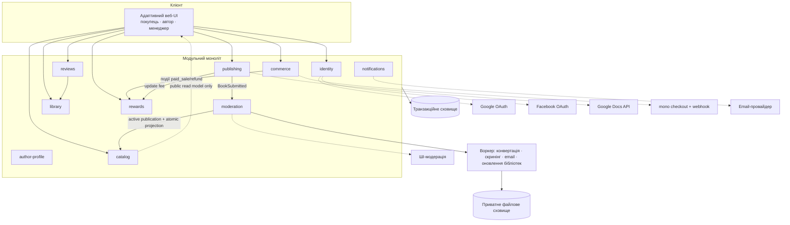

# Architecture

## Source References

- `docs/prd.md` — функціональні драйвери (FR-*), NFR, припущення A-1..A-4.
- `docs/product-idea.md` — авторитетне джерело наміру (PRD прямо посилається).
- `docs/project-context.md` — спожито: розд. 7 (platform), 9–11 (межі/обмеження), 13 (ризики).
- `docs/canonical-terms.md` — ідентифікатори сутностей.
- `docs/guardrails.md` — заборонені зміни, правила доказовості.
- `docs/user-journey.md`, `docs/screen-map.md`, `docs/wireframes.md`, `docs/design-brief.md` — поверхні, стани, навігаційна модель та Approved Baseline `AVB-UKIEBOOK-AURORA-7B-V3` (UI-межі).
- `forge/design/README.md` і `forge/design/candidates/operator-final-7b/v3/README.md` — React + TypeScript recommendation, visual-reference-not-production-code constraint та immutable V3 correction target.
- `package.json`, `app/`, `components/aurora/`, `modules/platform/`, `db/`, `workers/`, `scripts/` і `tests/` — реалізований UNIT-00 foundation at revision `f6e503b242d5a5eca59972dece1657f4d207b3e3`; canonical verification evidence: `forge/runs/UNIT-00/20260721T202102Z-f6e503b242d5/`.
- `app/login/`, `app/api/auth/`, `app/author/profile/`, `components/identity/`, `modules/identity/`, `modules/author-profile/`, `modules/payout-details/`, migration `0002_identity_sessions_author_profile`, `scripts/verify-unit01-postgres.ts` і UNIT-01 tests — реалізований identity/profile slice at revision `ab030a00f213d33f62783f0287dd8e5dcfe67101`; canonical evidence: `forge/runs/UNIT-01/20260721T221049Z-ab030a00f213/`. Доказ покриває S-03, S-17 і access guards у межах UNIT-01, включно з виміряними AA control contrast і ≥44px interactive targets; live consent у зареєстрованих production apps Google/Facebook лишається окремим activation gate і не позначений як passed.
- `app/page.tsx`, `app/books/[id]/`, `components/catalog/`, `modules/catalog/`, migration `0003_catalog_read_model`, production brand/Cover assets, `scripts/verify-unit02-postgres.ts` і UNIT-02 tests — original public catalog/Book Page slice at revision `a441ab415d2818872599f01efae856acebf75b42`; canonical historical evidence: `forge/runs/UNIT-02/20260722T011333Z-a441ab415d28/`. Its V2 visual receipt is superseded, while its catalog behavior remains implementation history.
- UNIT-02-C1 at revision `3f77594bcb615847bdd71846374184cd2070d305`; canonical correction evidence `forge/runs/UNIT-02-C1/20260722T115720Z-338d4450e107/run.json` — active S-01 visual correction against `AVB-UKIEBOOK-AURORA-7B-V3`: transparent SVG logo, square-corner covers, seven unique baked-artwork assets, uncropped shelf, exact hero copy and `35/65` ribbon. This correction changes presentation/configured percentage truth, not the catalog module boundary.
- `app/author/books/`, `app/author/publish/`, `app/api/author/publishing/`, `components/publishing/`, `modules/publishing/`, migration `0004_publishing_pipeline`, UNIT-03 verifier and tests — completed publishing/conversion slice at revision `6fb52daf3ff11630454c13a76adfd7875c749e8f`; canonical evidence `forge/runs/UNIT-03/20260722T151115Z-6fb52daf3ff1/run.json`. The evidence covers S-10/S-11/S-12 through immutable `BookVersion` + `BookSubmitted`, real DOCX/TXT/bounded Google Docs conversion to validated EPUB and legacy MOBI, private local-storage proof behind the production object-storage port, retry/draft preservation, and the Aurora Author extension. It ends before Manual Review, publication activation and the public catalog projection.
- `db/migrations/0005_moderation_publication.ts`, `modules/moderation/`, `workers/worker.ts`, `app/admin/moderation/`, `app/author/books/[id]/`, `app/books/covers/[bookId]/route.ts`, `scripts/verify-unit04-postgres.ts` and UNIT-04 tests — completed moderation/publication implementation at revision `4552048aeb2ba6da16b47ac289058b14d5641869`: `BookSubmitted` relay, safe-fail screening, S-13/S-18, immutable screening/decision/audit records, a separate active-publication pointer, atomic Catalog activation/removal and the publication-gated public Cover route. Canonical evidence: `forge/runs/UNIT-04/20260722T190601Z-4552048aeb2b/run.json`.
- `db/migrations/0006_commerce_checkout.ts`, `modules/commerce/`, `modules/notifications/`, `app/cart/`, `app/checkout/`, `app/api/cart/`, `app/api/checkout/`, `app/api/payments/mono/webhook/route.ts`, commerce worker handlers and UNIT-05 tests — completed commerce/purchase-notification implementation at revision `92e820ffc4e5c69752543457ad7fecf12e960c15`: persistent guest/Buyer Cart merge, immutable Order snapshots, mono create/status/public-key adapter, exact-raw-body signed webhook, durable reconciliation, transactional append-only `PaidSale`, isolated E-01 delivery and S-04/S-05/S-06. Canonical evidence: `forge/runs/UNIT-05/20260727T215803Z-92e820ffc4e5/run.json`. Library entitlement/file delivery and Refund remain UNIT-06.
- `db/migrations/0007_library_reviews_refunds.ts`, `modules/library/`, review-moderation handlers, `/library`, `/api/library/*`, `/api/reviews`, `/admin/refunds` and UNIT-06 tests — completed Library/review/Refund implementation at revision `484a56dc41698dd8965e9b39b1cc79f25d91eca7`: idempotent `PaidSale` entitlement consumption, active-approved-version EPUB/MOBI authorization, verified-Buyer reviews with manual moderation, append-only Refund compensation and revocation. Canonical evidence: `forge/runs/UNIT-06/20260729T002426Z-484a56dc4169/run.json`.

## Architecture Overview

UkieBook — адаптивний вебзастосунок із трьома ролевими поверхнями (Покупець, Автор, Менеджер) над спільним ядром. Архітектурні драйвери: (1) конвеєр перетворення Рукопису в EPUB/MOBI з обов'язковим Попереднім переглядом видання; (2) комерція із зовнішньою оплатою mono та точним обліком Оплачених продажів; (3) прозорий фінансовий лідж Нарахувань за поточною робочою формулою; (4) двоступенева модерація (ШІ → Ручна перевірка); (5) сувора сепарація даних.

Форма: модульний моноліт із явними межами модулів і асинхронним воркером для важких/фонових задач. Це найпростіша архітектура, що задовольняє PRD; межі модулів — міграційні шви на випадок майбутнього виділення сервісів.

## Architecture Principles

1. Найпростіше, що задовольняє PRD; жодної інфраструктури «на виріст» без джерела.
2. Гроші — лише через незмінюваний лідж подій; жодних перерахунків «на льоту» без сліду (FR-REW, FR-PYT, guardrails: доказ перед твердженням).
3. Платіжні дані карток не торкаються платформи — вся PCI-поверхня в mono (FR-PAY-3).
4. Кожен модуль володіє своїми даними; міжмодульний доступ — через явні інтерфейси.
5. Довгі операції (конвертація, модерація, email) — асинхронні з видимими станами (screen-map: стани завантаження/помилок).
6. Ролі й межі маршрутів — точно за Navigation Model зі screen-map; жодних прихованих адмін-шляхів.

## System Context

Актори: Гість, Покупець, Автор, Менеджер (canonical-terms). Зовнішні системи: Google OAuth, Facebook OAuth, інтеграція імпорту Google Docs, mono (plata by mono), email-провайдер, ШІ-модераційний сервіс. Межі походять із project-context розд. 7/9; Google Docs API є adapter-рішенням цієї архітектури, а не новою продуктовою вимогою.

## Module And Boundary Map

| Модуль | Володіє | Обслуговує екрани |
|---|---|---|
| `identity` | Користувачі, OAuth-звʼязки й одноразові flows, явні ролі, hashed sessions, append-only identity audit | S-03; guard-и всіх `/author/*`, `/admin/*`, `/library` |
| `author-profile` | Лише публічне імʼя/псевдонім; public DTO не містить OAuth email чи платіжних полів | S-17 |
| `payout-details` | Закритий encrypted envelope договірних/платіжних/податкових даних; зміст і UI належать UNIT-07 | S-16 |
| `publishing` | Рукописи, private-object metadata, конвеєр конвертації, Обкладинки, immutable `publishing_book_versions`, артефакти Попереднього перегляду видання, Безкоштовний фрагмент і окремі Декларації прав/ліцензії. Версія після подання лишається immutable зі статусом `submitted`; публікаційний стан не записується назад у неї. S-13 показує bounded lifecycle/read model; Discount і повний S-14 лишаються окремими owning scopes. | S-10..S-14 |
| `catalog` | Публічна additive read projection опублікованих книжок: жанри, featured slots, пошук/фільтри/стабільне сортування/пагінація, integer-kopiyka ціни й dated Discount, безкоштовні фрагменти та опубліковані відгуки. Publication activation/removal updates the bounded projection with version/event provenance in the same transaction; DTO не читають приватні publishing/identity поля. Public Cover bytes resolve only through the active `book_publications` boundary. | S-01, S-02 |
| `moderation` | `BookSubmitted` relay; cases for Book/BookUpdate/review; append-only screening runs and manager decisions; closed, versioned ReasonCategory values; internal AI signals; separate `book_publications` active-version pointer; append-only publication audit. Update/Review support in UNIT-04 is a decision/event contract only and does not mutate their future owning tables. | S-18; lifecycle status in S-10/S-13 and unavailable S-02 |
| `commerce` | Persistent guest/Buyer Кошик, immutable Order/OrderItem price snapshots, платіжні сесії mono, signed webhook observations, reconciliation issues and append-only `PaidSale`; UNIT-06 додає idempotent Refund request/decision та окрему append-only compensation. | S-04..S-06, S-09/S-20 |
| `library` | Ідемпотентно споживає `PaidSale`, володіє правами покупця, видає signed EPUB/MOBI лише власнику, resolve-ить активну схвалену версію та відкликає доступ після Refund | S-07 |
| `reviews` | Рейтинги й відгуки лише підтверджених покупців, `ReviewSubmitted`, manual moderation та public projection | S-08, блок відгуків S-02 |
| `rewards` | Лідж нарахувань, утримання 250 грн, місячні payout-рядки, статуси виплат, перемикач засновника | S-15, S-19, S-21 |
| `notifications` | Email після покупки (E-01) | — |

Правила меж: `publishing` емітить immutable `BookSubmitted`; `moderation` вибирає активну версію й атомарно записує publication pointer + Catalog projection, а public `catalog` ніколи не читає приватний draft/object graph напряму. `commerce` емітить versioned append-only `PaidSale`; UNIT-06 `library` є його ідемпотентним споживачем і єдиним власником entitlement. `library` емітить versioned `RefundApproved` після exactly-once compensation, але не пише майбутній rewards ledger. `rewards` слухає `PaidSale`/`RefundApproved` і `publishing` update-fee events; reviews перевіряє покупку через `library`; ПД покупців не перетинають межу `rewards`-звітів автора (FR-REW-6).

## Runtime And Automation Model

- Веб-процес: синхронні запити UI + API.
- Воркер асинхронних задач: конвертація UNIT-03; UNIT-04 moderation relay/handler; UNIT-05 commerce reconciliation and purchase-notification delivery; UNIT-06 entitlement, review-ingress and review-decision relays. Перед poll воркер ідемпотентно перетворює unpublished `BookSubmitted`/`PaidSale`/`ReviewSubmitted`/review-decision events на їхні owned downstream records. Commerce jobs звіряють незавершені provider sessions beyond webhook arrival/outage and always enqueue a durable successor until authoritative terminal resolution. Notification jobs consume `PurchaseNotificationRequested` independently, so provider failure never rolls back `PaidSale`.
- Вебхук-приймач mono: bounded exact raw body + ECDSA signature verification; invoice/reference/amount/currency binding; idempotent/out-of-order-safe observation; successful terminal transition atomically writes paid Order + append-only `PaidSale` + outbox. Failure/cancel preserves Cart and creates no `PaidSale`; UNIT-06 Refund never mutates the sale and records one separate compensation plus `RefundApproved`.
- Планувальник: щомісячна побудова payout-таблиці (рядок автор×місяць, FR-PYT-2) з ліджа; застосування переносів <100 грн (FR-PYT-4) і утримань 250 грн (FR-UPD-2).
- Ручні рішення S-18 — синхронні revision-checked/idempotent transactions: immutable decision + event, а для Book approval/removal також publication pointer, audit event і Catalog projection змінюються атомарно. Підтвердження виплати й рішення щодо повернення належать пізнішим units.

## Data And State Model

Ключові сутності (ідентифікатори — canonical-terms):

- `user` → explicit `user_role` assignments + `oauth_account` provider mapping + hashed `session`; `oauth_flow` одноразово тримає зашифровані PKCE/nonce та server-held author-onboarding intent; `identity_audit_event` є append-only. OAuth email не використовується для автоматичного злиття облікових записів.
- `author_profile` містить лише публічне імʼя; закритий `author_payout_details` уже має окрему encrypted-envelope межу (`schema_version`, `key_id`, nonce, ciphertext, authentication tag), але модель винагороди ФОП/роялті та S-16 реалізує UNIT-07 (FR-AUTH-3/4).
- `book_draft` володіє revision-guarded editable metadata, current private Manuscript/Cover/Illustration links, conversion status/result, current `PreviewArtifact` і `sample_preview_artifact_id`. Submission freezes one immutable `publishing_book_version` (його status назавжди `submitted`), writes separate rights/license declarations and emits one versioned `BookSubmitted` outbox event. Aggregate lifecycle lives on `publishing_books`; publish/unavailable state and active version live separately in `book_publications`. `discount` remains UNIT-08 scope.
- Публічний `catalog_book_read_model` є окремою projection-моделлю для S-01/S-02, а не джерелом приватного publishing state. Він зберігає лише public Author identity, жанр, опис/sample, publication-gated Cover route, availability, рейтинг і integer-kopiyka price presentation; `source_book_version_id`, `source_event_id` і `projection_revision` дають provenance. Activation upserts `published`; FR-LIC-4 removal marks the same row `unavailable` in the transaction that updates `book_publications` and audit. UNIT-02 fixture seed явно підтверджується й заборонений у production.
- `rights_declaration` — привʼязана до подання версії (FR-PUB-8).
- `moderation_case` — idempotent subject envelope (`book`/`book_update`/`review`), trigger, revision and queue status. `moderation_screening_run`, `moderation_decision`, `publication_audit_event` and versioned `moderation_reason_category` rows are update/delete-protected append-only records. Internal signals stay on screening runs; Book/Update rejection alone requires a closed ReasonCategory; Review `do_not_publish` carries none; FR-LIC-4 removal requires one closed removal ground plus explicit confirmation, not a ReasonCategory.
- `book_publication` — exactly one row per Book with `active_book_version_id`, state `published|unavailable`, activation case, optional removal decision and monotonically increasing revision. It is the public-version authority; immutable `book_version` history is never rewritten.
- Related BookUpdate/Review ingress stores their own subject IDs plus immutable Book context and emits typed `ModerationDecisionRecorded`; UNIT-04 deliberately does not apply update files or publish/reject a review in those future modules.
- `commerce_cart` is owned either by a SHA-256 digest of an opaque guest cookie token or by Buyer ID; OAuth return merges/deduplicates guest items into the Buyer Cart and clears the raw token. Checkout freezes `commerce_order` + ordinal `commerce_order_item` title/Author/Cover/price snapshots and seals them when one `commerce_payment_session` is created. Provider observations are append-only/auditable; terminal success atomically appends one `commerce_paid_sale` and versioned outbox event.
- `library_entitlement` — унікальний `PaidSale` item → покупець×книжка grant із purchased-version provenance та `active|refunded` status. Download resolve-ить `book_publications.active_book_version_id`, а якщо його немає — immutable purchased version; ownership і HMAC expiry перевіряються server-side (FR-LIB-1/3).
- `library_review` — покупець×книжка, рейтинг, текст, `pending_moderation|published|not_published`; eligibility потребує active entitlement, а public projection зʼявляється лише після immutable Manager decision (FR-REV-1/2).
- `refund_request` + append-only `refund_compensation` — revision-checked Manager decision; approval атомарно відкликає entitlement і додає одну versioned `RefundApproved` outbox event без переписування `PaidSale` (FR-PAY-5, FR-REF-1..3).
- Лідж `accrual`: незмінювані події +65% від фактично сплаченої ціни (`paid_sale`), −65% (повернення), −250 грн (`book_update` fee, з чергою очікування накопичення), окремий override засновника 100% (FR-FND-2). Стандартна allocation rule зберігає exact basis points: `platform_net_revenue_bps=2900`, `platform_tax_component_bps=600`, `author_share_bps=6500`; публічне `platform_share_bps=3500` є сумою перших двох. Інваріанти: `2900 + 600 = 3500`, `3500 + 6500 = 10000`. Похідне: `payout_row` (автор×місяць): сума продажів, чистий заробіток платформи 29%, податковий компонент платформи 6%, частка автора 65%, сума до виплати, статус (очікує/підтверджено/виплачено/перенесено) — FR-PYT-2/4. Founder override маркується окремо й не підміняє standard invariant.

Стан у UI: стани екранів — власність screen-map; сервер — джерело істини для статусів модерації, платежів і виплат; клієнт лише відображає.

## Integration Map

| Інтеграція | Напрям | Контракт | Помилковий шлях |
|---|---|---|---|
| Google OAuth / Facebook OAuth | вихідний redirect + callback | authorization code + PKCE S256; Google OIDC додатково перевіряє nonce, JWKS-підпис, issuer/audience/subject і збіг `userinfo.sub`; звʼязування лише за provider+subject; provider tokens після перевірки не зберігаються | відмова/помилка/повтор callback → S-03 з контрольованим кодом; flow одноразовий, failure audit append-only |
| Google Docs API | вихідний | імпорт документа за наданим автором доступом | помилка формату → dropzone S-11 |
| mono (plata by mono) | create-invoice/status/public-key HTTPS adapter + redirect + signed inbound webhook | one immutable Order snapshot → one provider invoice; exact raw-body ECDSA verification; invoice/reference/amount/currency binding; idempotent/out-of-order-safe observations; durable status reconciliation | provider/config/protocol error is generic to Buyer and audit-safe; failure/cancel → S-06 failure with Cart preserved; missed webhook/outage keeps a durable reconciliation successor |
| Email-провайдер | вихідний durable adapter | idempotent E-01 after `PaidSale` (перелік книжок + лінк бібліотеки); deterministic file capture is test-only | retry/isolation records failure without rolling back paid Order/`PaidSale`; production remains unavailable until a transactional provider is configured |
| ШІ-модерація | вихідний adapter через durable worker | versioned screening input over immutable BookVersion artifacts; clear → system publication, flagged → S-18; internal signals manager-only | exception/provider outage is persisted as `provider_error` and routed to S-18 (safe-fail); never auto-publish |

## Technology Stack And Constraints

Найменший reversible stack, що задовольняє джерела й фінальний handoff:

- **Repository/runtime:** один TypeScript repository; pinned Node `24.16.0` development toolchain with runtime floor `>=20.19.0`, npm `11.13.0`, Next.js `16.2.11`, React `19.2.8` and TypeScript `6.0.3`; Next.js App Router для SSR public catalog, React UI, server routes/actions for synchronous API, окремі Node.js worker/scheduler processes у тому самому modular-monolith codebase. `package.json`, `.node-version` і lockfile є implementation source of truth для точних версій.
- **Frontend:** CSS custom properties + CSS Modules/vanilla authored CSS; жодна generic UI library не може підмінити Aurora 7b. Shared accessible primitives wrap semantic controls without changing Baseline geometry.
- **Persistence:** PostgreSQL; committed reversible migrations with advisory-lock serialization and checksum verification; explicit transactions behind an inward SQL port. PGlite is test-only and never substitutes for the real-PostgreSQL acceptance proof. Monetary values stored only as integer kopiykas; percentage model stored as exact basis points/rules (`2900 + 600 + 6500 = 10000`; `platform_share_bps = 3500`), never binary floating point.
- **Async/durability:** PostgreSQL-backed durable job table/queue + worker, transactional outbox from domain transactions, semantic idempotency conflict detection, lease renewal/loss cancellation, bounded retries and dead-letter state. Monthly payout generation is a scheduled job using the same mechanism.
- **Files:** domain code depends on `PrivateObjectStorage`; database holds metadata/hashes/version links. UNIT-03 proves private persistence and Author-scoped reads; UNIT-06 proves short-lived signed/authorized purchased-file delivery after entitlement ownership and Refund-state checks. Production remains private S3-compatible object storage supplied through the same adapter/deployment boundary in UNIT-10; the local receipt is not an S3 deployment claim.
- **Auth:** pinned `oauth4webapi` production adapters для Google/Facebook; authorization code + PKCE S256, Google OIDC nonce/JWKS verification; opaque 256-bit session/flow tokens, у PostgreSQL зберігаються лише SHA-256 digests; AES-GCM для server-held flow values; HMAC-bound CSRF; `HttpOnly`, `SameSite=Lax`, `Secure`/`__Host-` cookies для HTTPS; centralized explicit-capability guards; жодних auth/provider tokens у browser storage або OAuth-token columns.
- **Payments:** mono redirect checkout; HTTPS-only production adapter for create-invoice/status/public-key, bounded provider responses, ECDSA exact-raw-body webhook verification with public-key rotation/cooldown, unique invoice/session/observation keys, immutable financial snapshots, atomic `PaidSale` + outbox and scheduled reconciliation. Local HTTP is accepted only for loopback under `APP_ENV=test`.
- **Email/AI:** separate replaceable provider ports with deterministic test fakes. The production email port is explicitly unavailable until a transactional provider is configured; notification failure is isolated from the paid transaction. The production AI port is also explicitly unavailable until configured, and its error safe-fails only moderation into `manual_review_pending`. Selecting either provider does not cross its domain interface.
- **Conversion:** isolated `EditionConverter` uses the proven `calibre-legacy-mobi-v1` adapter on Calibre `9.11.0` to produce normalized intermediate content, EPUB, legacy MOBI and a persisted `PreviewArtifact`. UNIT-03 validates outputs with `epub-container.v1` and `legacy-mobi-header.v1`, preserves inline Illustrations for DOCX/Google Docs, records meaning hashes, rejects stale jobs and exposes typed failure/retry without silently dropping MOBI.
- **Verification tooling:** Vitest `4.1.10` and Playwright `1.61.1`; stable commands `npm run build`, `npm run lint`, `npm run typecheck`, `npm test`, `npm run test:e2e`, `npm run test:visual` are executable. Historical UNIT-00…UNIT-05 receipts retain their revision-bound contracts. `npm run verify:unit06` passed independently on committed revision `484a56dc41698dd8965e9b39b1cc79f25d91eca7` over dedicated embedded loopback PostgreSQL database `ukiebook_unit06`, reversible schema revision `0007_library_reviews_refunds`, 7 domain proof vectors, 129 passed/3 skipped tests, 2/2 Buyer/Manager E2E and 12 S-07/S-08/S-09/S-20 responsive visual receipts; canonical evidence is `forge/runs/UNIT-06/20260729T002426Z-484a56dc4169/run.json`. This command does not invoke or reuse `verify:unit05`.
- **Deployment topology:** three process roles from one revision — web, worker, scheduler — plus managed PostgreSQL and private object storage. Environments use injected secrets/config; secrets never enter Git or client bundles. Hosting vendor remains replaceable.
- **Card data:** never stored or processed by UkieBook; mono owns payment entry surface.

## Security Privacy And Access Model

- RBAC: `buyer`, `author`, `manager` — окремі явні ролі/capabilities без порядку успадкування; роль Автора надається лише атомарно зі збереженням першого S-17, після чого всі попередні сесії відкликаються й видається replacement session; guard-и маршрутів відповідають Navigation Model.
- OAuth boundary: safe `returnTo` allow-list не допускає зовнішні/службові маршрути; flow claim одноразовий; provider mapping не auto-links за email; forged Google signature, wrong nonce і `userinfo.sub` mismatch fail closed без створення user/account/session.
- Сепарація даних: `author_payout_details` — закритий encrypted-envelope піддомен; public `AuthorProfile` повертає лише `authorId` і `publicName`; ПД покупців ніколи не потрапляють у авторські звіти (FR-REW-6); статус засновника невидимий у авторських поверхнях (FR-FND-3).
- Платежі: платформа тримає лише hashed guest Cart ownership, immutable order snapshots, ідентифікатори/статуси mono і bounded audit observations; raw Cart token та карткові дані ніколи не зберігаються (FR-PAY-3). Checkout/result are Buyer-ownership checked; webhook signature plus invoice/reference/amount/currency binding fails closed.
- Файли книжок: видача лише автентифікованому власнику `library_item`; посилання — короткоживучі/авторизовані.
- Внутрішні сигнали/правила модерації — лише у manager-gated case detail та append-only screening record. Author S-13 receives only the closed, versioned `reason_category` for own rejected Book; public/Author DTOs and emitted public lifecycle events exclude internal signals.
- Private case artifacts use a manager-role and case/object-membership boundary. Public `/books/covers/{bookId}` resolves bytes only through `book_publications.active_book_version_id`; guests never receive an Author-private object URL.
- Аудит-слід: рішення менеджера (модерація, виплати, повернення, перемикач засновника) фіксуються з часом і актором.
- Webhook secrets, OAuth secrets, database/object-storage credentials and email/AI keys are server-only injected secrets; logs redact tokens and personal fields.
- Same-origin + session-bound CSRF перевірки захищають mutation boundaries, including every S-18 decision/removal action; invalid Origin/CSRF changes no moderation state. Auth/RBAC/persistence failures не маскуються як validation success.
- UNIT-03 upload endpoints stream bounded multipart bodies with declared-size overhead and actual file-size enforcement; the Google Docs JSON endpoint is also body-bounded before parsing. Private objects are resolved through Author ownership, never exposed by a public object URL.
- Enabling a new Автор-засновник is one transaction that clears any prior singleton assignment, writes the new assignment and audit event, or changes nothing on failure.

## Performance Reliability And Observability

- Конвертація — асинхронна з явними станами й bounded retry; UNIT-03 proves `conversion_failed` → retry → `ready` on the same draft without data loss, rejects stale jobs, and binds sample selection to the completed current `PreviewArtifact` before submission.
- Вебхуки mono — ідемпотентні й не можуть регресувати стан за stale/equal/non-authoritative timestamp; втрачений вебхук, missing `modifiedDate` або provider outage компенсується authoritative status reconciliation with durable continuation beyond the nominal invoice horizon and an explicit overdue issue until terminal recovery.
- Лідж — append-only: будь-яка сума в S-15/S-19 відтворюється з подій (доказовість guardrails).
- Базова спостережуваність: логи конвеєра конвертації, платіжних подій і модераційних рішень — мінімум для ручних процесів менеджера.
- Every job and webhook carries correlation/idempotency IDs; dead-letter jobs and reconciliation mismatches are visible to operations before payout generation.
- Каталог SSR виконує лише bounded public projection queries із deterministic tie-breaker, fixed page size та additive DTO contract; unavailable Book виключається із browse/search, але зберігає стабільну S-02 unavailable response без ціни чи sample.
- `BookSubmitted` relay, screening jobs and manager decisions use semantic idempotency keys; case revision + row lock + one-decision-per-case uniqueness reject stale/concurrent second decisions. Activation/removal, outbox event, audit row and Catalog projection share one database transaction, preventing half-published states.

## Architecture Diagram

## Architecture Decision Log

### AD-1 Модульний моноліт, не мікросервіси

- Source References: PRD (MVP із ручними процесами Менеджера), project-context розд. 13.
- Alternatives Considered: мікросервіси; безсерверні функції на кожен домен.
- Why This Direction: найменша складність, що задовольняє PRD; UNIT-00 implementation підтверджує, що web/worker/scheduler and PostgreSQL foundation can share one revision and inward contracts without distributed-service overhead.
- Consequences: межі модулів — дисципліна коду, не мережі; виділення сервісу в майбутньому — по швах модулів.

### AD-2 Незмінюваний лідж нарахувань + похідні payout-рядки

- Source References: FR-REW-2/3, FR-PYT-2/4, FR-UPD-2, FR-REF-3; guardrails (доказ перед твердженням).
- Alternatives Considered: зберігати лише агреговані баланси.
- Why This Direction: прозорість формули для автора і звіряність кожної суми; повернення й утримання — природні компенсаційні події.
- Consequences: більше подій у сховищі; будь-який звіт відтворюваний; помилки виправляються компенсаціями, не правками історії.

### AD-3 Оплата mono через redirect + ідемпотентний вебхук

- Source References: FR-PAY-3/5; OQ-SM1 (дефолт redirect); journey Failure Path.
- Alternatives Considered: вбудований віджет mono.
- Why This Direction: найменша інтеграційна поверхня і нульова PCI-зона платформи; віджет — зворотна заміна пізніше.
- Consequences: покупець тимчасово покидає сайт; потрібна надійна обробка повернення і звірка сесій.
- Implementation Evidence: UNIT-05 revision `92e820ffc4e5c69752543457ad7fecf12e960c15` proves HTTPS production configuration, create/status/public-key protocol binding, exact-raw-body ECDSA verification, public-key rotation, duplicate/out-of-order/missing-timestamp handling, atomic append-only `PaidSale`, failed-Cart preservation and durable reconciliation in `forge/runs/UNIT-05/20260727T215803Z-92e820ffc4e5/run.json`. Live credentialed mono and Apple Pay/Google Pay presentation remain a provider-activation gate.

### AD-4 Конвертація як асинхронний конвеєр із артефактом Попереднього перегляду видання

- Source References: FR-PUB-2/6/7; стани S-11/S-12 (помилка конвертації); project-context розд. 13 (головний технічний ризик).
- Alternatives Considered: синхронна конвертація в запиті.
- Why This Direction: DOCX/GDocs непередбачувані за часом; асинхронність дає чесні стани прогресу й помилок.
- Consequences: потрібен воркер і статусна модель версії Книжки; `PreviewArtifact` — окремий збережений артефакт до подання.
- Implementation Evidence: UNIT-03 revision `6fb52daf3ff11630454c13a76adfd7875c749e8f` proves the worker/job path, persisted preview, stale-job guard, failure/retry recovery and immutable submission boundary in `forge/runs/UNIT-03/20260722T151115Z-6fb52daf3ff1/run.json`.

### AD-5 ШІ-модерація як замінний зовнішній сервіс із safe-fail у ручну чергу

- Source References: FR-MOD-1/2; project-context розд. 9/13.
- Alternatives Considered: вбудована модель; блокування публікацій при недоступності ШІ.
- Why This Direction: провайдер не зафіксований джерелами; сигнал ШІ — вхід для людини, тож деградація в ручну чергу зберігає безпеку без зупинки платформи.
- Consequences: інтерфейс скринінгу абстрактний; вибір провайдера — відкрите питання без зміни меж.

### AD-6 TypeScript modular monolith: Next.js web + separate Node worker

- Decision: один TypeScript codebase із Next.js/React SSR web-процесом і окремим worker/scheduler runtime.
- Source References: A-1 adaptive web; public catalog needs indexable server-rendered pages; `forge/design/README.md` recommends React + TypeScript; AD-1 modular monolith.
- Alternatives Considered: SPA + separate API; multiple services; serverless-only functions.
- Why This Direction: найменше дублювання contracts/types, SSR для Каталогу, clear isolation for long-running conversion/jobs.
- Consequences: web and worker deploy separately from the same revision; shared domain modules cannot import UI/runtime adapters inward.

### AD-7 PostgreSQL ledger/outbox/job backbone

- Decision: PostgreSQL owns transactional domain state, append-only Нарахування, outbox and durable jobs; money is integer kopiykas.
- Source References: FR-PAY-5, FR-REW-2/3, FR-PYT; AD-2; reliability needs.
- Alternatives Considered: document database; in-memory queue; floating-point money; external queue before product scale requires it.
- Why This Direction: one ACID boundary prevents payment/ledger/event divergence and remains simplest for MVP.
- Consequences: migrations and transaction boundaries are first-class; worker claims jobs atomically; future external queue migration keeps outbox contract.

### AD-8 Aurora-first frontend primitives, not prototype promotion

- Decision: reimplement approved Baseline in semantic React components and CSS tokens; `forge/design/candidates/operator-final-7b/v3/ukiebook-catalog.html` is an immutable visual target and is not copied as production application code.
- Source References: Approved Baseline `AVB-UKIEBOOK-AURORA-7B-V3`, target bundle hash `e50c9f82c241195d7f5d8876d9dcdcd7fd45b71cdaf6d2eedfe2e327a7182724`; handoff About the Design Files; guardrails Evidence Requirements.
- Alternatives Considered: direct HTML copy; generic component library defaults; image-to-code promotion.
- Why This Direction: exact visual target and production semantics/states can coexist without inheriting demo-only div/span controls or non-responsive CSS.
- Consequences: `Prototype Reuse: none`; visual diffs use the V3 target bundle (HTML + candidate-local covers + authoritative transparent-background SVG logo), while functionality is implemented independently and proven by runtime gates. Every rendered Book Cover remains square-cornered; cover titles in pixels come from artwork assets, never a live overlay.

### AD-9 Private versioned artifacts and authorized delivery

- Decision: Рукопис, `PreviewArtifact`, EPUB/MOBI та Обкладинки зберігаються як immutable/versioned private objects із database hashes; завантаження потребує чинної авторизації.
- Source References: FR-PUB-6/7, FR-LIB-1..3, NFR-3; project-context privacy constraints.
- Alternatives Considered: public permanent URLs; database blobs; mutable file overwrite.
- Why This Direction: prevents cross-buyer access and makes approved updates reproducible without destroying prior artifacts.
- Consequences: object lifecycle/retention is explicit; signed URLs are short-lived; `library_entitlement` resolves the active approved `book_version` and rejects non-owner, invalid-signature, expired and refunded requests. UNIT-03 proves the port/private local adapter and immutable object provenance; UNIT-06 proves purchased-file authorization and latest-approved-version resolution. Production S3-compatible adapter/deployment remains UNIT-10.

### AD-10 Server-owned OAuth identity with explicit roles and rotated opaque sessions

- Decision: Google/Facebook callbacks завершують одноразовий server-owned flow; provider+subject є єдиним ключем OAuth-звʼязку, ролі перевіряються як окремі capabilities, а зміна authorization state відкликає старі hashed sessions і видає нову opaque session.
- Source References: FR-AUTH-1..3, S-03/S-17, NFR-3; UNIT-01 implementation/evidence at `ab030a00f213d33f62783f0287dd8e5dcfe67101`.
- Alternatives Considered: JWT у browser storage; auto-link за email; role hierarchy; роль Автора одразу після OAuth.
- Why This Direction: не довіряє mutable email як identity key, мінімізує browser secret surface, не підвищує first-time user до Автора до валідного S-17 і робить authorization change негайно відкличним.
- Consequences: потрібні persistent flow/session tables, centralized guards, CSRF/Origin checks і credentialed smoke перед production activation кожного provider app.

### AD-11 Public catalog projection isolates browse reads from private publishing state

- Decision: S-01/S-02 читають із PostgreSQL projection tables owned by `catalog`; `BookCatalogReadModel`, `BookPageReadModel`, `CatalogQuery` and `PricePresentation` are additive public contracts. The projection stores integer-kopiyka prices, half-open Discount windows and only public Author fields. UNIT-02 bootstrap data enters only through an explicitly acknowledged, production-rejected deterministic seed; UNIT-04 publication transactions update the same boundary with `source_book_version_id`, `source_event_id` and `projection_revision`.
- Source References: FR-CAT-1..4; NFR-3; UNIT-02 catalog contracts; migration `0005_moderation_publication`; `modules/moderation/server/service.ts`.
- Alternatives Considered: query private publishing/identity tables directly from SSR; client-side fixture catalog; expose one broad Book aggregate to every surface.
- Why This Direction: public discovery needs stable, indexable, privacy-minimized reads while publishing versions and moderation state evolve independently. The bounded projection keeps unavailable/private fields out by construction and makes search/filter/sort/pagination behavior reproducible.
- Consequences: activation and FR-LIC-4 removal update publication state and the Catalog row atomically; unavailable Books disappear from browse/search while their stable S-02 response remains; read DTO changes are additive; fixture seed is never a production publication path.

### AD-12 Separate active publication pointer with append-only moderation evidence

- Decision: immutable `publishing_book_versions` remain submitted artifacts; `book_publications` alone names the active public version and availability. Screening runs, ReasonCategory copy versions, Manager decisions and publication audit events are append-only; only case/aggregate lifecycle projections advance.
- Source References: FR-MOD-1..5, FR-LIC-4, FR-CAT-3; migration `0004_publishing_pipeline`; migration `0005_moderation_publication`; `modules/moderation/server/service.ts`.
- Alternatives Considered: mutate `book_version.status`; infer the active version from the latest row; store only the current screening/decision; update Catalog in a later best-effort job.
- Why This Direction: immutable submitted artifacts preserve exact reviewed bytes, while one explicit pointer prevents two active versions. Append-only evidence keeps AI/Manager actions auditable, and one transaction prevents publication/Catalog divergence.
- Consequences: Book approval/rejection/removal is revision-checked and idempotent; public Cover delivery follows the pointer; internal signals stay manager-only. UNIT-04 BookUpdate/Review handling proves decision/event contracts only—their producers and downstream application remain with the owning later units.

## Risks And Mitigations

| Ризик | Джерело | Мітигація |
|---|---|---|
| Якість конвертації DOCX/GDocs з Ілюстраціями | project-context розд. 13 | Обовʼязковий Попередній перегляд видання (FR-PUB-6); асинхронний конвеєр з чесними помилками; рання fixture-перевірка реальних Рукописів |
| Регресія legacy MOBI при зміні Calibre/toolchain | FR-PUB-7 | UNIT-03 closes the engine choice with pinned Calibre `9.11.0`, adapter `calibre-legacy-mobi-v1`, representative fixtures and `legacy-mobi-header.v1`; any converter/runtime change reruns the full conversion proof |
| Розбіжність вебхуків mono і фактичних оплат | FR-PAY-5 | Exact-body signature + invoice/reference/amount/currency binding; append-only observations; timestamp guard; authoritative status reconciliation with durable successor and overdue issue until terminal recovery |
| Помилки в ручних виплатах | FR-PYT | Лідж як єдине джерело сум; payout-рядки — похідні; аудит-слід підтверджень |
| Витік ПД через звіти | FR-REW-6, NFR-3 | Сепарація доменів даних; звіти автора будуються без полів покупця |
| Розбіжність локально перевіреного OAuth adapter contract із production app/redirect registration | FR-AUTH-1, NFR-3 | Loopback protocol simulator + негативні OIDC-вектори в CI; credentialed Google/Facebook consent smoke є обовʼязковим activation gate |
| Недоступність ШІ або накопичення Ризикових випадків | FR-MOD-1/2; project-context розд. 13 | provider errors persist as safe-fail screening runs; queue remains actionable in S-18; no outage path auto-publishes |
| Подвійне/застаріле рішення або розбіжність publication/Catalog | FR-MOD-2/3, FR-LIC-4 | case revision + row lock + unique decision/idempotency keys; active pointer, audit and Catalog projection change in one transaction |

## Out Of Scope

Внутрішня читалка; нативні застосунки; мультивалютність/мультимовність; автоматичні виплати без менеджера; DRM (джерела не вимагають — файли видаються покупцеві напряму).

## Open Questions

- OQ-AR1 closed: TypeScript + Next.js/React web + separate Node worker in one modular-monolith repository (AD-6).
- OQ-AR2 closed: PostgreSQL with transactional ledger/outbox/jobs and integer-kopiyka money (AD-7).
- OQ-AR3 closed by UNIT-03: Calibre `9.11.0` through `calibre-legacy-mobi-v1` produced validated EPUB (`epub-container.v1`) and legacy MOBI (`legacy-mobi-header.v1`) from representative DOCX/TXT/bounded Google Docs fixtures, including inline Illustrations where applicable; canonical proof is `forge/runs/UNIT-03/20260722T151115Z-6fb52daf3ff1/run.json`.
- OQ-AR4. Production email and ШІ-модерація providers remain independent adapter selections. The unavailable email adapter records/retries notification failure without rolling back `PaidSale`; the unavailable AI adapter safely routes only moderation to S-18. Deterministic fakes are test-only, and provider choice is an activation/operations gate rather than an architecture blocker.
- OQ-AR5 closed at topology level: web + worker + scheduler + managed PostgreSQL + private object storage; vendor choice remains operational and replaceable.
