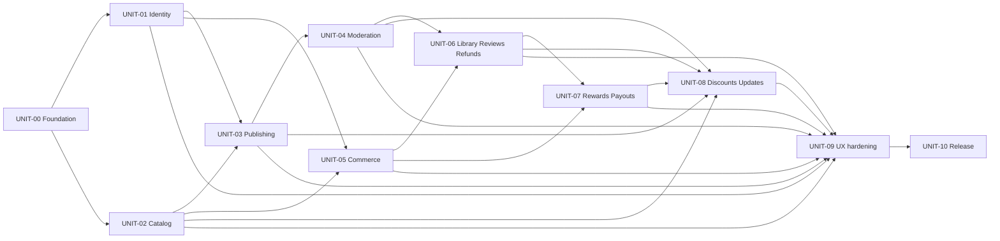

# Development Plan

## Source References

- `docs/prd.md` v1.1 — product scope, FR/NFR, US-001…US-012, acceptance scenarios.
- `docs/project-context.md` — applied: section 7 (adaptive Ukrainian web/UAH), 11 (privacy/design constraints), 13 (conversion/operations/reference risks).
- `docs/canonical-terms.md` — applied roles, domain objects/actions/states, Screen/Flow Names and Terms to Avoid.
- `docs/user-journey.md`, `docs/screen-map.md`, `docs/wireframes.md` — journey, S-01…S-21, routes/states/structure.
- `docs/design-brief.md` — Approved Baseline `AVB-UKIEBOOK-AURORA-7B-V2`; target bundle hash `c66b23c55e68649e67e029d47c8e69d3bef3791f8c4c6677aa0a6cef2259c51d`; tree hash `8aaddd35645bd9c58c095a7182fbbbd43dd8730c5cf90b489a97597431cc6505`; permitted variance.
- `docs/architecture.md` — AD-1…AD-9, module/data/integration/security/runtime contracts.
- `docs/dod-evals.md` — standing DoD and reusable gates.
- `docs/qa-checklist.md` — concrete ACC/UJ/ST/WF/UX/VIS/RES/A11Y/INT/BD checks.
- `docs/guardrails.md` — authority, evidence and high-risk boundaries.
- `forge/design/README.md` and `forge/design/candidates/operator-final-7b/v2/` immutable target artifacts — visual reference only, no runtime truth.
- `UkieBook-logo.jpg` — official logo source, SHA-256 `5cdd21d3ba038632528fc17a13068e3792d03a029779251cd738aaada4aa0ad3`; scoped operator override in the active Baseline.
- `UkieBook-logo-exact.svg` — official equivalent SVG container, SHA-256 `abb3acf8cfa673161e6547ca725f7b337b29185a7eb6918218f887faadc66d98`; byte-identical embedded JPEG, not path-based vector artwork. Equivalence evidence: `forge/design/evidence/UkieBook-logo-svg-equivalence.json`.

## Implementation Strategy

Build one TypeScript modular monolith as dependency-ordered vertical slices. Bootstrap the verification and data foundations first; then develop public catalog/identity and independently testable domain seams; integrate publishing, commerce, library, moderation and rewards through explicit contracts. Finish with cross-product visual/accessibility hardening and release topology.

The public S-01 desktop V2 target, including the rendered official logo, is reimplemented exactly in semantic React/CSS, not copied as application logic. S-02…S-21 extend Aurora 7b through the approved Design/Experience Spine. Every visible unit binds to the same Baseline ID/hash and the exact-vs-extension coverage rules. Static HTML never substitutes for real auth, data, persistence, integrations, security or state behavior.

Money is integer kopiykas; ledger/outbox/jobs are transactional PostgreSQL records; objects are private and versioned; mono webhook handlers are idempotent; AI/email/conversion are adapters. Tests verify SDD truth rather than define it.

## Codebase Map

Current UNIT-00 foundation at revision `f6e503b242d5a5eca59972dece1657f4d207b3e3`:

```text
app/
  api/health/               web runtime/revision health
  fixtures/aurora/          explicit non-product VIS-TOKENS fixture
components/
  aurora/                   tokens and accessible visual primitives
modules/
  platform/                 runtime identity, SQL port, transactions, outbox/jobs, env/evidence
db/
  migrations/               reversible checksummed PostgreSQL migrations
  postgres.ts               production adapter
  pglite.ts                 test-only adapter
workers/
  worker.ts scheduler.ts    separate executable roles
scripts/                    build, boundary, hygiene and UNIT-00 evidence runners
tests/
  unit/ integration/ e2e/ visual/
```

Product route groups `(public)`, `author`, `admin`, domain modules, integrations and `public/brand` are introduced by their owning later units; they are not claimed as present by UNIT-00.

Module imports point inward to domain contracts; UI and provider adapters may depend on domain interfaces, never the reverse. Cross-module mutation happens through commands/events, not direct table writes.

## Implementation Units

### UNIT-00 — Repository, runtime, data and verification foundation

- **Execution Status:** `completed` on 2026-07-21 at implementation revision `f6e503b242d5a5eca59972dece1657f4d207b3e3`; canonical passed run `forge/runs/UNIT-00/20260721T202102Z-f6e503b242d5/run.json`.
- **Purpose:** bootstrap the executable TypeScript/Next.js/worker runtime and stable evidence commands in the already initialized project repository without implementing product journeys.
- **Source References:** architecture AD-1/6/7/8/9; dod-evals Hard Gates; design-brief tokens/accessibility floor.
- **Depends On:** none.
- **Work Items:** initialize the npm workspace; scaffold Next.js App Router, Node worker and scheduler entrypoints; PostgreSQL migration/query layer; transaction/outbox/job primitives; environment validation and secret boundaries; CSS token layer matching Aurora; accessible primitive skeletons; Vitest/Playwright configuration; commands `build`, `lint`, `typecheck`, `test`, `test:e2e`, `test:visual`; evidence/result directories and format.
- **Acceptance Checks:** all six npm commands exist; build/lint/typecheck/unit smoke run locally; migrations can apply/rollback on an empty database; worker claims one test job idempotently; no secret enters client bundle; token snapshot equals design-brief/V2 values.
- **Verification:** DoD `build`, `typecheck_lint`, `tests`; architecture boundary review; `VIS-TOKENS` token-export/computed-style fixture; `npm run test:visual` can capture a fixture route.
- **Delivery Layer:** infrastructure.
- **Baseline Impact:** enables later user-visible UI; no shippable product screen.
- **Prototype Reuse:** none.
- **Interfaces Produced:** `DomainTransaction`, `OutboxEvent`, `DurableJob`, environment contract, Aurora token module, Eval Result writer.
- **Interfaces Consumed:** none.
- **API/Data Contract References:** architecture AD-6/7/8/9.
- **Interface Owner:** platform foundation.
- **Compatibility Expectations:** migrations are forward-safe; event/job envelopes are versioned; npm command names remain stable.
- **Integration Verification:** web and worker use the same schema/revision; one committed transaction emits one outbox event and one idempotent job.
- **Completion Evidence:** all six stable commands passed; production web/worker/scheduler identities matched; real PostgreSQL migration/transaction/concurrency/idempotency/lease proofs passed; repository and browser secret-boundary proofs passed; UNIT-00 `VIS-TOKENS` fixture passed; zero open P0/P1 or blocking P2. Prototype reuse remained `none`, so no promotion receipt applies.

### UNIT-01 — Identity, sessions, RBAC and Author profile

- **Purpose:** implement Google/Facebook OAuth, role guards, public Author name and protected-data separation; deliver S-03/S-17.
- **Source References:** FR-AUTH-1..4; US-002; S-03/S-17 states/routes; architecture `identity`/`author-profile` and Security; QA ACC-01, ST-02/06/11, A11Y-02/03.
- **Depends On:** UNIT-00.
- **Work Items:** OAuth provider adapters/callbacks; persistent session and provider mapping; Guest/Buyer/Author/Manager guards; first-Author redirect S-03→S-17→S-11; public `author_profile` separate from encrypted/restricted `payout_details`; audit login/role changes; semantic provider controls.
- **Acceptance Checks:** only named OAuth methods appear; return-to-source works; protected-route matrix passes; Author cannot access Manager routes; public responses never expose payout fields; S-17 saves canonical public name.
- **Verification:** ACC-01; UJ-01 auth segment; ST-02/06/11; `access_separation`; A11Y-02/03/07; browser smoke.
- **Delivery Layer:** full-stack.
- **Approved Baseline ID:** `AVB-UKIEBOOK-AURORA-7B-V2`.
- **Immutable Visual Target Hash:** `c66b23c55e68649e67e029d47c8e69d3bef3791f8c4c6677aa0a6cef2259c51d`.
- **Baseline Screens States And Viewports:** S-03/S-17 all screen-map states at 390/430/768/1280/1440; Aurora extension coverage, no pixel target.
- **Design Contract And Permitted Variance:** Aurora forms/glass/tokens, provider brand controls, readable labels; exact S-01 not touched.
- **Operator Visual Overrides:** final 7b system only; no alternative candidate styling.
- **Visual Fidelity Verification:** `approved_visual_baseline_fidelity` via `VIS-AURORA-PUBLIC`, `VIS-AURORA-AUTHOR`, `VIS-TOKENS`, `VIS-GLASS`, affected RES/A11Y.
- **Prototype Reuse:** none.
- **Production Capabilities Added Beyond Prototype:** OAuth, sessions, RBAC, persistent profile, validation/errors/audit.
- **Interfaces Produced:** `AuthSession`, `UserRole`, `AuthorProfile`, route guard policy.
- **Interfaces Consumed:** UNIT-00 transaction/session storage.
- **API/Data Contract References:** FR-AUTH; canonical roles/actions; architecture identity boundary.
- **Interface Owner:** `identity` / `author-profile`.
- **Compatibility Expectations:** role/session schema additive; public profile DTO excludes restricted fields by construction.
- **Integration Verification:** OAuth callback→session→role redirect→profile save; negative role matrix.

### UNIT-02 — Aurora public catalog and Book Page

- **Purpose:** deliver production S-01 and S-02 with exact desktop baseline plus search/filter/read-model behavior and responsive states.
- **Source References:** FR-CAT-1..4, FR-AUTH-2, US-001/004; S-01/S-02; wireframes S-01/S-02; Approved Baseline and official JPG/exact-SVG-container override; architecture AD-8; QA ACC-08, ST-01, WF-02/04, UX-03/04/07, VIS-S01-*, VIS-TOKENS, VIS-GLASS, VIS-COVER, VIS-FORMULA, VIS-BRAND-LOGO.
- **Depends On:** UNIT-00. Can start with source fixtures; authenticated header integration consumes UNIT-01 when ready.
- **Work Items:** copy both official logo files to `public/brand/`, choose either container explicitly, and create only visually identical optimized/transparent derivatives; do not treat the raster-backed SVG as a scalable vector optimization; semantic Aurora header/hero/shelf/tiles/formula; exact 1280 layout/hover; catalog repository/read model, title/Author/Genre/Discount query, pagination; Book Page with sample/reviews slot; real icons; loading/empty/error/unavailable states; deterministic responsive reflow; authenticated Library/profile affordance integration.
- **Acceptance Checks:** S-01 1280 default/hover matches target within permitted variance; official logo identity is preserved inside the locked header geometry; header labels/copy exact; search/filter URLs/state work; Book Page includes all FR-CAT-3 content; no horizontal overflow at required viewports; semantic keyboard controls replace demo divs without visual drift.
- **Verification:** ACC-08; ST-01; WF-02/04; UX-03/04/07; VIS-S01-1280-DEFAULT/HOVER/RESPONSIVE; VIS-AURORA-PUBLIC; VIS-TOKENS; VIS-GLASS; VIS-COVER; VIS-FORMULA; VIS-BRAND-LOGO; RES-01/02; A11Y-01/02/04/06/08; INT-04.
- **Delivery Layer:** full-stack.
- **Approved Baseline ID:** `AVB-UKIEBOOK-AURORA-7B-V2`.
- **Immutable Visual Target Hash:** `c66b23c55e68649e67e029d47c8e69d3bef3791f8c4c6677aa0a6cef2259c51d`.
- **Baseline Screens States And Viewports:** exact S-01 `/` default/cover+tile hover at 1280×900; derived S-01 states at 390/430/768/1440; S-02 all states at 390/768/1280 via extension contract.
- **Design Contract And Permitted Variance:** all Baseline permitted variance; functional result continuation follows formula or existing controls; no insertion inside locked sequence.
- **Operator Visual Overrides:** 1:1 S-01, skip candidate generation, and use the official JPG or its proven byte-identical SVG container without changing locked header geometry.
- **Visual Fidelity Verification:** `approved_visual_baseline_fidelity` with all `VIS-S01-*`, `VIS-AURORA-PUBLIC`, `VIS-TOKENS`, `VIS-GLASS`, `VIS-COVER`, `VIS-FORMULA` and `VIS-BRAND-LOGO` checks.
- **Prototype Reuse:** none.
- **Production Capabilities Added Beyond Prototype:** routing, real data/query, semantic controls, responsive layout, state handling, accessibility, Book Page.
- **Interfaces Produced:** `CatalogQuery`, `BookCatalogReadModel`, `BookPageReadModel`, `PricePresentation`.
- **Interfaces Consumed:** UNIT-00 persistence/tokens; optional UNIT-01 `AuthSession`.
- **API/Data Contract References:** FR-CAT; screen-map S-01/S-02; canonical Book/Genre/Discount/Free Sample.
- **Interface Owner:** `catalog`.
- **Compatibility Expectations:** read DTOs are versioned/additive; price always integer kopiykas + formatted UAH.
- **Integration Verification:** fixture→query/filter→S-01/S-02; auth-state header; visual target comparisons.

### UNIT-03 — Publishing, conversion proof and Author wizard

- **Purpose:** prove EPUB/MOBI engine and deliver S-10/S-11/S-12 from draft to submitted Book version.
- **Source References:** FR-PUB-1..9, FR-LIC-1..3, US-002/003; journey Author 1–8; S-10…S-12; architecture AD-4/9 and OQ-AR3; QA ACC-02..04, UJ-01/03, ST-04, INT-02.
- **Depends On:** UNIT-00, UNIT-01; UNIT-02 read-model interface for the Сторінка книжки inside Попередній перегляд видання.
- **Work Items:** first run a bounded converter enabler on representative DOCX/TXT/Google Docs fixtures with inline Illustrations; select/prove concrete EPUB/MOBI adapter or emit typed blocker; implement private uploads/version hashes, technical normalization, fallback Cover, free-sample selection, background conversion, draft persistence, Попередній перегляд видання/Сторінки книжки; separate rights and license confirmations; submit event returns Author to S-10/S-13.
- **Acceptance Checks:** both formats validate on fixtures; technical cleanup never rewrites meaning; conversion failure preserves draft and reports recovery; Попередній перегляд видання covers all FR-PUB-6 zones; submission blocked unless both confirmations are true; Author never enters S-18.
- **Verification:** `conversion_pipeline`, `journey_author_e2e` through submission, ACC-02..04, ST-04, WF-03/04, INT-02, storage authorization tests.
- **Delivery Layer:** full-stack.
- **Approved Baseline ID:** `AVB-UKIEBOOK-AURORA-7B-V2`.
- **Immutable Visual Target Hash:** `c66b23c55e68649e67e029d47c8e69d3bef3791f8c4c6677aa0a6cef2259c51d`.
- **Baseline Screens States And Viewports:** S-10/S-11/S-12 all states at 390/430/768/1280/1440; Aurora Author extension coverage.
- **Design Contract And Permitted Variance:** calm Aurora forms/statuses, Literata reading surface after provenance check, clear legal blocks; no pixel target.
- **Operator Visual Overrides:** 7b visual system; rights/license functionality added without redesign.
- **Visual Fidelity Verification:** `approved_visual_baseline_fidelity` via `VIS-AURORA-AUTHOR`, `VIS-TOKENS`, `VIS-GLASS`, `VIS-COVER`, RES-04, A11Y forms/dialogs.
- **Prototype Reuse:** none.
- **Production Capabilities Added Beyond Prototype:** upload/storage, conversion, draft/version state, Попередній перегляд видання, Cover fallback, legal confirmations.
- **Interfaces Produced:** `BookDraft`, `BookVersion`, `ConversionJob/Result`, `PreviewArtifact`, `BookSubmitted`.
- **Interfaces Consumed:** UNIT-01 `AuthSession/AuthorProfile`; UNIT-02 `BookPageReadModel` shape; UNIT-00 jobs/storage.
- **API/Data Contract References:** FR-PUB/LIC; AD-4/9.
- **Interface Owner:** `publishing`.
- **Compatibility Expectations:** converter input/output adapters are replaceable; BookVersion immutable; events schema-versioned.
- **Integration Verification:** upload→job→artifacts→Попередній перегляд видання→two confirmations→submitted state.

### UNIT-04 — Manual Review and Book lifecycle

- **Purpose:** deliver moderation routing, S-13/S-18, type-specific decisions and audited removal under FR-LIC-4.
- **Source References:** FR-MOD-1..5, FR-LIC-4; US-010; supporting Manager journey; S-13/S-18; architecture AD-5; QA ACC-05/06, ST-05/07, UJ-05.
- **Depends On:** UNIT-01, UNIT-03; UNIT-02 publication read model.
- **Work Items:** AI adapter/fake and safe-fail; moderation_case states; Manager queue/detail; Book/Update Author Reason Category; review decision without unsupported buyer reason; publication activation; audited removal of risky published Book; downstream status/read-model events.
- **Acceptance Checks:** safe item and risky/manual paths work; internal criteria absent from public DTO/logs; each object type produces correct downstream state; removal requires reason/confirmation and makes S-02 unavailable; Author receives only canonical Reason Category.
- **Verification:** `moderation_flow`, `access_separation`, ACC-05/06, ST-05/07, UJ-05, audit inspection.
- **Delivery Layer:** full-stack.
- **Approved Baseline ID:** `AVB-UKIEBOOK-AURORA-7B-V2`.
- **Immutable Visual Target Hash:** `c66b23c55e68649e67e029d47c8e69d3bef3791f8c4c6677aa0a6cef2259c51d`.
- **Baseline Screens States And Viewports:** S-13/S-18 states at 390/768/1280; S-02 unavailable state.
- **Design Contract And Permitted Variance:** Aurora Author/Manager extension; status semantics consistent; destructive confirmation explicit.
- **Operator Visual Overrides:** final 7b system.
- **Visual Fidelity Verification:** `approved_visual_baseline_fidelity` via `VIS-AURORA-AUTHOR/MANAGER/PUBLIC`, `VIS-TOKENS`, `VIS-GLASS`, `VIS-COVER` and UX-05/06.
- **Prototype Reuse:** none.
- **Production Capabilities Added Beyond Prototype:** AI routing, Manual Review, audit, publication lifecycle and removal.
- **Interfaces Produced:** `ModerationCase`, `ModerationDecision`, `PublicationActivated/Removed`, `ReasonCategory`.
- **Interfaces Consumed:** `BookSubmitted`, UNIT-01 Manager role, UNIT-02 catalog publisher.
- **API/Data Contract References:** FR-MOD/LIC-4; moderation module boundary.
- **Interface Owner:** `moderation`.
- **Compatibility Expectations:** public decision DTO never includes internal signals/rules; decisions idempotent/audited.
- **Integration Verification:** submitted→AI result→queue→decision→Author/public state.

### UNIT-05 — Cart, orders, mono and purchase notification

- **Purpose:** deliver S-04/S-05/S-06 and E-01 with idempotent Paid Sale events.
- **Source References:** FR-PAY-1..5, US-006; Buyer journey/failure; architecture AD-3/7; QA ACC-09, UJ-02/03, ST-02, INT-01, BD-02.
- **Depends On:** UNIT-00, UNIT-01, UNIT-02.
- **Work Items:** persistent/mergeable Cart; order price snapshot; mono redirect adapter/sandbox; webhook verification/idempotency/reconciliation; payment result; transactional `PaidSale` outbox event; email adapter/fake and E-01; failure preserves Cart.
- **Acceptance Checks:** multi-book one payment; auth return and failure recovery; one provider event/session creates one paid order/event; unpaid/cancelled order creates no Paid Sale; email failure does not block Library entitlement event.
- **Verification:** `webhook_idempotency`, `paid_sale_only`, Buyer e2e through success/failure, ACC-09, ST-02, INT-01, captured email.
- **Delivery Layer:** full-stack/integration.
- **Approved Baseline ID:** `AVB-UKIEBOOK-AURORA-7B-V2`.
- **Immutable Visual Target Hash:** `c66b23c55e68649e67e029d47c8e69d3bef3791f8c4c6677aa0a6cef2259c51d`.
- **Baseline Screens States And Viewports:** S-04/S-06 all states at 390/768/1280; S-05 external provider surface excluded from visual control.
- **Design Contract And Permitted Variance:** Aurora public checkout shell; provider-owned payment UI follows provider; Cart rows reflow per wireframes.
- **Operator Visual Overrides:** final 7b system.
- **Visual Fidelity Verification:** `approved_visual_baseline_fidelity` via `VIS-AURORA-PUBLIC`, `VIS-TOKENS`, `VIS-GLASS`, RES-03, A11Y/INT.
- **Prototype Reuse:** none.
- **Production Capabilities Added Beyond Prototype:** Cart persistence, orders, provider session/webhook, email and state transitions.
- **Interfaces Produced:** `Cart`, `Order`, `PaymentSession`, `PaidSale`, `PurchaseNotificationRequested`.
- **Interfaces Consumed:** UNIT-01 session; UNIT-02 PricePresentation; UNIT-00 outbox/jobs.
- **API/Data Contract References:** FR-PAY; AD-3/7.
- **Interface Owner:** `commerce` / `notifications`.
- **Compatibility Expectations:** price snapshot immutable; webhook event key unique; provider adapter replaceable.
- **Integration Verification:** catalog→Cart→auth→mono sandbox/webhook→result→PaidSale/email.

### UNIT-06 — Library, reviews and Refund workflow

- **Purpose:** deliver S-07/S-08/S-09/S-20 and purchased-file authorization.
- **Source References:** FR-LIB-1..3, FR-REV-1/2, FR-REF-1..3; US-007/008; supporting Refund journey; architecture AD-9; QA ACC-10/11, ST-03/09.
- **Depends On:** UNIT-01, UNIT-02, UNIT-04 for review moderation, UNIT-05 for PaidSale.
- **Work Items:** consume PaidSale to create `library_item`; signed EPUB/MOBI download; latest approved version resolution; verified-Buyer review and moderation status; Refund request modal/Manager queue/decision; `RefundApproved` compensation event; status propagation.
- **Acceptance Checks:** unpaid/non-owner cannot download/review; Buyer can re-download both formats; newest approved version resolves; review does not promise unsupported rejection reason; Refund decision updates Buyer status and emits one compensation.
- **Verification:** ACC-10/11, UJ-02/04, ST-03/09, object authorization tests, update propagation hook, Refund idempotency.
- **Delivery Layer:** full-stack.
- **Approved Baseline ID:** `AVB-UKIEBOOK-AURORA-7B-V2`.
- **Immutable Visual Target Hash:** `c66b23c55e68649e67e029d47c8e69d3bef3791f8c4c6677aa0a6cef2259c51d`.
- **Baseline Screens States And Viewports:** S-07/S-08/S-09/S-20 all states at 390/768/1280.
- **Design Contract And Permitted Variance:** Aurora public/Manager extension, accessible modal, file actions equal priority.
- **Operator Visual Overrides:** final 7b system.
- **Visual Fidelity Verification:** `approved_visual_baseline_fidelity` via `VIS-AURORA-PUBLIC/MANAGER`, `VIS-TOKENS`, `VIS-GLASS`, `VIS-COVER`, RES-03/05, A11Y-07.
- **Prototype Reuse:** none.
- **Production Capabilities Added Beyond Prototype:** entitlements, signed downloads, review eligibility/moderation, Refund/audit/compensation.
- **Interfaces Produced:** `LibraryEntitlement`, `ReviewSubmitted`, `RefundRequest`, `RefundApproved`.
- **Interfaces Consumed:** `PaidSale`, `BookVersion`, moderation decision, storage signer.
- **API/Data Contract References:** FR-LIB/REV/REF; AD-9.
- **Interface Owner:** `library` / `reviews` / `commerce` Refund subdomain.
- **Compatibility Expectations:** entitlement unique by Buyer+Book; version pointer changes only on approved update; compensation idempotent.
- **Integration Verification:** PaidSale→Library/download/review; Refund request→Manager decision→status/event.

### UNIT-07 — Ledger, Rewards, Payouts and Founder Author

- **Purpose:** deliver financial source of truth and S-15/S-16/S-19/S-21.
- **Source References:** FR-REW-1..6, FR-PYT-1..4, FR-FND-1..4, FR-UPD-2; US-009/011/012; architecture AD-2/7; QA ACC-12..14, ST-06/08/10, VIS-FORMULA.
- **Depends On:** UNIT-00, UNIT-01, UNIT-05 PaidSale; UNIT-06 RefundApproved.
- **Work Items:** append-only accrual ledger in integer kopiykas; paid/Refund compensation; current provisional basis-point split; per-Book reward read model; payout_details/model; monthly payout rows/threshold/carry; confirm actual Payout one-by-one; atomic singleton Founder Author transfer; restricted DTOs/audit.
- **Acceptance Checks:** all money vectors exact to kopiyka; ledger reproduces S-15/S-19; no Buyer personal data in Author API; <100 carries; each row independent; one Founder under concurrency; Founder receives 100% and update-fee exemption contract.
- **Verification:** `money_formula`, `ledger_reproducibility`, `paid_sale_only`, `payout_rules`, `access_separation`, ACC-12..14, ST-06/08/10, concurrency tests.
- **Delivery Layer:** full-stack.
- **Approved Baseline ID:** `AVB-UKIEBOOK-AURORA-7B-V2`.
- **Immutable Visual Target Hash:** `c66b23c55e68649e67e029d47c8e69d3bef3791f8c4c6677aa0a6cef2259c51d`.
- **Baseline Screens States And Viewports:** S-15/S-16/S-19/S-21 at 390/768/1280; formula motif may recur on S-15.
- **Design Contract And Permitted Variance:** Aurora Author/Manager extension, tabular numbers, quiet financial UI, consequences before CTA.
- **Operator Visual Overrides:** final 7b system; formula visual preserved while legal status remains provisional.
- **Visual Fidelity Verification:** `approved_visual_baseline_fidelity` via `VIS-AURORA-AUTHOR/MANAGER`, `VIS-TOKENS`, `VIS-GLASS`, `VIS-FORMULA`, UX-02/05, RES-04/05.
- **Prototype Reuse:** none.
- **Production Capabilities Added Beyond Prototype:** ledger, money rules, private payout data, monthly scheduler/read models, singleton Founder transaction.
- **Interfaces Produced:** `AccrualEvent`, `RewardReadModel`, `PayoutRow`, `PayoutConfirmed`, `FounderAssignment`.
- **Interfaces Consumed:** `PaidSale`, `RefundApproved`, UNIT-01 roles/payout profile, scheduler.
- **API/Data Contract References:** FR-REW/PYT/FND; AD-2/7.
- **Interface Owner:** `rewards`.
- **Compatibility Expectations:** ledger immutable; rule version recorded per event; public/Author read models exclude Buyer PII.
- **Integration Verification:** PaidSale/Refund→ledger→monthly row→Manager confirmation→Author status; concurrent Founder transfer.

### UNIT-08 — Discounts and Book Update integration

- **Purpose:** complete post-publication Author operations S-13/S-14 and their cross-module effects.
- **Source References:** FR-CAT-4, FR-UPD-1..3, FR-FND-4; supporting Discount/Update journeys; QA ACC-07/08, UJ-04, ST-05.
- **Depends On:** UNIT-02, UNIT-03, UNIT-04, UNIT-06, UNIT-07.
- **Work Items:** dated Discount state/value validation; actual-price read model for catalog/cart/rewards; Update submission with optional Manuscript/Cover; 250 UAH pending-fee/reservation logic and Founder exemption; re-conversion/moderation; atomic active-version switch; Library latest-version propagation and fee accrual.
- **Acceptance Checks:** Discount changes exactly at boundaries; paid price drives ledger; ordinary Author sees 250 UAH consequence before submit; insufficient accrual waits; Founder sees no fee; approval updates prior Buyer files without double fee/version switch.
- **Verification:** ACC-07/08, UJ-04, ST-05, `payout_rules`, `update_propagation`, date-boundary and idempotency tests.
- **Delivery Layer:** full-stack/integration.
- **Approved Baseline ID:** `AVB-UKIEBOOK-AURORA-7B-V2`.
- **Immutable Visual Target Hash:** `c66b23c55e68649e67e029d47c8e69d3bef3791f8c4c6677aa0a6cef2259c51d`.
- **Baseline Screens States And Viewports:** S-02/S-07/S-13/S-14/S-15/S-18 affected states at 390/768/1280.
- **Design Contract And Permitted Variance:** Aurora extension; Discount badges/old-new price; financial warning before CTA; status semantics shared.
- **Operator Visual Overrides:** final 7b system.
- **Visual Fidelity Verification:** `approved_visual_baseline_fidelity` for affected public/Author/Manager checks plus `VIS-TOKENS`, `VIS-GLASS`, `VIS-COVER` and `VIS-FORMULA` where the affected surface uses them.
- **Prototype Reuse:** none.
- **Production Capabilities Added Beyond Prototype:** time rules, cross-module update state, fee and Library propagation.
- **Interfaces Produced:** `DiscountSchedule`, `BookUpdateSubmitted/Approved`, `UpdateFeeAccrued`, `BookVersionActivated`.
- **Interfaces Consumed:** catalog PricePresentation, publishing converter, moderation decisions, library entitlement, rewards ledger.
- **API/Data Contract References:** FR-CAT-4/UPD/FND-4.
- **Interface Owner:** `catalog` Discount + `publishing` Book Update orchestration.
- **Compatibility Expectations:** event handlers idempotent; old BookVersion immutable; price/fee rule version traceable.
- **Integration Verification:** Discount/Update journeys across all consuming modules.

### UNIT-09 — Whole-product responsive, accessibility and visual hardening

- **Purpose:** close all Baseline, responsive, accessibility, state and browser gates after functional slices exist.
- **Source References:** Approved Baseline; wireframes Responsive; QA WF/UX/VIS/RES/A11Y/BD; dod-evals UX/UI gates.
- **Depends On:** UNIT-01…UNIT-08.
- **Work Items:** full route/state capture matrix; exact S-01 diffs; dedicated token/glass/Cover/formula invariant evidence; official-logo selected-container/derivative hash and shape comparison, including the SVG equivalence receipt when used; measured contrast corrections within variance; semantic/control/focus audit; target-size/zoom/reflow fixes; mobile master-detail/table/form layouts; reduced-motion verification; cross-browser critical journeys; canonical copy sweep; regression snapshot baselines keyed by Baseline ID/hash.
- **Acceptance Checks:** every applicable visual/accessibility/responsive check passes; no unsupported viewport overflow; all controls keyboard-operable; S-01 exact scope remains unchanged beyond permitted variance; no blocking P0/P1/P2.
- **Verification:** `npm run test:visual`, `npm run test:e2e`, VIS-S01-*, VIS-AURORA-*, VIS-TOKENS, VIS-GLASS, VIS-COVER, VIS-FORMULA, VIS-BRAND-LOGO, RES-01..06, A11Y-01..08, BD-01/02, `approved_visual_baseline_fidelity` for every visible unit.
- **Delivery Layer:** frontend/integration.
- **Approved Baseline ID:** `AVB-UKIEBOOK-AURORA-7B-V2`.
- **Immutable Visual Target Hash:** `c66b23c55e68649e67e029d47c8e69d3bef3791f8c4c6677aa0a6cef2259c51d`.
- **Baseline Screens States And Viewports:** S-01 exact/default/hover 1280; S-01 derived 390/430/768/1440; S-02…S-21 all canonical states at applicable required viewports.
- **Design Contract And Permitted Variance:** exact Baseline section; no additional variance can be invented here.
- **Operator Visual Overrides:** imported final 7b, 1:1 covered scope, responsive/a11y extension allowed, official logo identity locked to the JPG; the exact raster-backed SVG is an equivalent container, not a new visual target.
- **Visual Fidelity Verification:** `approved_visual_baseline_fidelity` full affected matrix.
- **Prototype Reuse:** none.
- **Production Capabilities Added Beyond Prototype:** complete responsive states, semantics, accessibility, browser evidence and regression tooling.
- **Interfaces Produced:** VisualQAEvidence/eval results keyed by route/state/viewport/Baseline.
- **Interfaces Consumed:** all visible route/state contracts and target artifacts.
- **API/Data Contract References:** QA checklist and Baseline.
- **Interface Owner:** frontend platform + each affected module owner.
- **Compatibility Expectations:** visual snapshots include Baseline ID/hash; fixture changes are explicit and reviewed.
- **Integration Verification:** full product route matrix and both critical journeys across browser floor.

### UNIT-10 — Deployment, operations and release-candidate evidence

- **Purpose:** deploy one revision as web/worker/scheduler and produce release evidence without converting external legal/provider questions into code assumptions.
- **Source References:** architecture deployment topology; dod-evals Release Checks; guardrails high-risk authorization; product-idea pre-release checks; QA Release Readiness.
- **Depends On:** UNIT-00…UNIT-09.
- **Work Items:** environment topology, migrations, private object storage, secret injection, worker/scheduler health, logs/correlation/dead-letter visibility, backup/restore rehearsal, mono reconciliation, release eval aggregation; record external legal/tax, mono terms and font provenance evidence when supplied.
- **Acceptance Checks:** all processes run same revision; migration/rollback and restore rehearsed; secrets server-only; dead letters/reconciliation observable; all applicable automated/manual gates have current evidence; no release occurs while external release blockers remain.
- **Verification:** full DoD Gate Matrix, `release_journeys`, `release_findings`, security/privacy/access checks, restore evidence, `legal_tax_review`, `mono_terms_confirmed`, font provenance.
- **Delivery Layer:** infrastructure/integration.
- **Baseline Impact:** serves all user-visible states/actions; deployment change must rerun smoke + affected visual evidence.
- **Prototype Reuse:** none.
- **Interfaces Produced:** deployed endpoints/process health, release Eval bundle, operational runbook.
- **Interfaces Consumed:** all prior module/process contracts.
- **API/Data Contract References:** architecture runtime/observability; dod-evals release format.
- **Interface Owner:** platform operations.
- **Compatibility Expectations:** environment config schema validated; rollback preserves database/object compatibility; release evidence references immutable revision and Baseline.
- **Integration Verification:** staged deployment→migration→critical journeys→worker/scheduler jobs→reconciliation→evidence bundle.

## Dependency Order



After UNIT-00, UNIT-01 and fixture-backed UNIT-02 can run in parallel. UNIT-03 and UNIT-05 can overlap once their consumed interfaces are frozen. No financial consumer begins against an unversioned `PaidSale`/`RefundApproved` event. UNIT-09 is a convergence unit, not a substitute for per-unit UX evidence.

## Verification Plan

- After every unit: `npm run typecheck`, `npm run lint`, `npm test`, `npm run build`; affected integration/e2e/visual commands follow the unit fields.
- For UNIT-00 foundation changes, `REAL_DATABASE_URL=<ephemeral-postgres-url> npm run verify:unit00` is the canonical bundle-producing rerun and must target real PostgreSQL.
- Persist results in dod-evals format with unit, revision, timestamp, evidence and findings. A missing applicable command/result is `blocked`, never passed by inspection.
- Money tests use integer fixtures, discount boundaries, duplicate/out-of-order events, Refund compensation, threshold/carry, update fee and Founder cases.
- Conversion tests use representative DOCX/TXT/Google Docs fixtures with headings, Unicode Ukrainian text and inline Illustrations; EPUB/MOBI validators are external evidence.
- Access tests cover every role/route and DTO data-minimization boundary.
- Cross-layer integration tests assert event schema/version, idempotency and producer/consumer ownership.
- Public release additionally requires legal/tax, mono-terms and font-provenance evidence; these are external gates, not reasons to omit code tests.

## Visual And UX Verification

- S-01 exact: compare fresh 1280×900 default/hover captures with immutable target and reference captures; record each deviation as permitted or finding.
- S-01 responsive: compare against approved reflow contract, not the non-responsive 390px reference squeeze.
- S-02…S-21: verify Aurora tokens/components/status semantics, wireframe hierarchy, canonical states and viewports; do not claim pixel equality where no target exists.
- Dedicated invariants: record separate `VIS-TOKENS`, `VIS-GLASS`, `VIS-COVER` and `VIS-FORMULA` results using the V2 component captures/computed styles as reference and fresh production evidence as the pass basis.
- Official logo: verify every rendered instance against `UkieBook-logo.jpg` and the V2 integrated reference. `UkieBook-logo-exact.svg` may be used after its recorded byte-equivalence check; optimization, vectorization or background removal may not redraw or distort the mark, and S-01 must preserve the locked 93.703125×26px brand slot.
- Every visual result records Baseline ID, target hash, route, state, viewport, fixture, variance, capture and finding release effect.
- Runtime interactions, data, auth and accessibility need their own evidence even when visual diff is green.

## Risks And Sequencing Notes

- **MOBI:** UNIT-03 begins with proof; inability to produce valid MOBI blocks publishing and triggers an upstream product decision, not a silent EPUB-only release.
- **Financial formula:** implement current exact provisional rule with versioned ledger metadata; legal/accounting change requires upstream SDD regeneration and migration plan.
- **mono:** provider docs/signature/tariffs must be refreshed just in time; sandbox behavior does not prove production commercial terms.
- **Design fidelity vs accessibility:** permitted variance authorizes only measured semantic/contrast/target/reflow fixes; UNIT-09 must prove both fidelity and AA rather than sacrificing either silently.
- **Logo source format:** the official mark is supplied as an opaque JPEG and a byte-identical raster-backed SVG wrapper. The SVG does not add vector geometry or transparency; any true-vector, transparent or optimized derivative must retain the source silhouette, proportions and internal line structure, with source/derivative hashes and rendered comparison evidence.
- **Manual operations:** Manager flows ship before automation; background jobs expose dead-letter/retry visibility so one failure does not corrupt payouts or hide moderation work.
- **Repository bootstrap:** Git/GitHub plus UNIT-00 application runtime, verification commands and CI-ready project structure are complete. Hosted deployment/CI topology remains UNIT-10 scope.

## Coverage Matrix

| Source scope | Owning implementation unit(s) |
|---|---|
| FR-AUTH, S-03/S-17 | UNIT-01 |
| FR-CAT, S-01/S-02 | UNIT-02; Discount integration UNIT-08 |
| FR-PUB, FR-LIC-1..3, S-10…S-12 | UNIT-03 |
| FR-MOD, FR-LIC-4, S-13/S-18 | UNIT-04; Update states UNIT-08 |
| FR-PAY, S-04…S-06, E-01 | UNIT-05 |
| FR-LIB/REV/REF, S-07…S-09/S-20 | UNIT-06 |
| FR-REW/PYT/FND, S-15/S-16/S-19/S-21 | UNIT-07 |
| FR-CAT-4/UPD/FND-4, S-13/S-14 and downstream states | UNIT-08 |
| All responsive/accessibility/visual states | each visible unit + convergence UNIT-09 |
| Deployment/release evidence | UNIT-10 |

All PRD FR groups and screen-map S-01…S-21 map to at least one unit. Out-of-scope product areas remain out of all units.

## Out Of Scope

Internal reader, fixed-layout books, native apps, subscriptions/bundles/promocodes, additional languages/currencies, automatic payouts without Manager, DRM, dark-mode switch, marketing-only site, generic redesign of Aurora 7b, direct prototype-code promotion.

## Open Questions

- OQ-DP1. Concrete MOBI engine is resolved by UNIT-03 proof evidence; this is a typed implementation blocker only if all candidate adapters fail the required fixtures.
- OQ-DP2. Production email and AI-moderation providers are selected behind existing adapters before deployment; local fakes make earlier units executable without inventing vendor commitments.
- OQ-DP3. Hosting vendor is selected when executing UNIT-10 within the fixed web/worker/scheduler/PostgreSQL/object-storage topology.
- Release-only external blockers remain: legal/tax review, mono current terms/tariffs and font license/provenance.
