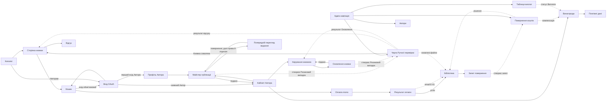

# Screen Map

## Source References

- `docs/prd.md` — FR-вимоги як джерело скоупу екранів.
- `docs/user-journey.md` — стадії подорожей автора (1–12) і покупця (1–9); OQ-UJ2.
- `docs/project-context.md` — спожито: розд. 7 (адаптивний веб, desktop + mobile browser).
- `docs/canonical-terms.md` — найменування екранів і обʼєктів.
- `docs/guardrails.md` — межі скоупу MVP.
- Пряма correction-команда оператора 2026-07-22 — публічний розподіл `35% платформі / 65% автору`; внутрішній менеджерський розклад `35 = 29 + 6`; active visual baseline `AVB-UKIEBOOK-AURORA-7B-V3`.

## Screen Inventory

### Публічні поверхні (гість)

| ID | Екран | Маршрут | Джерело |
|---|---|---|---|
| S-01 | Каталог із пошуком і фільтрами (назва, автор, жанр, знижки/акції) | `/` | FR-CAT-2, FR-AUTH-2 |
| S-02 | Сторінка книжки: обкладинка, назва, автор, жанр, опис, ціна/знижка, рейтинг, відгуки, безкоштовний фрагмент | `/books/{id}` | FR-CAT-3 |
| S-03 | Вхід через Google/Facebook | `/login` | FR-AUTH-1 |
| S-04 | Кошик | `/cart` | FR-PAY-2 |
| S-05 | Оплата mono (зовнішня поверхня провайдера: картка, Apple Pay, Google Pay) | зовнішній редирект/віджет | FR-PAY-3 |
| S-06 | Результат оплати (успіх/невдача) | `/checkout/result` | FR-PAY-4/5, journey «Failure Path» |

### Покупець

| ID | Екран | Маршрут | Джерело |
|---|---|---|---|
| S-07 | Бібліотека: куплені книжки, завантаження EPUB/MOBI, остання версія | `/library` | FR-LIB-1/2/3 |
| S-08 | Форма рейтингу й відгуку (поверхня на S-02, лише підтверджений покупець) | на `/books/{id}` | FR-REV-1/2 |
| S-09 | Запит на повернення коштів (модал із S-07) | на `/library` | FR-REF-1 |

### Автор

| ID | Екран | Маршрут | Джерело |
|---|---|---|---|
| S-10 | Кабінет автора: список моїх книжок зі статусами | `/author/books` | FR-PUB, FR-MOD-3 |
| S-11 | Майстер публікації: Рукопис → опис/Ілюстрації → Обкладинка → Жанр/ціна/Безкоштовний фрагмент → Попередній перегляд видання → Декларація прав + ліцензійна умова | `/author/publish` | FR-PUB-1..9, FR-LIC-2/3 |
| S-12 | Попередній перегляд Адаптивного видання і Сторінки книжки (крок майстра) | `/author/publish/preview` | FR-PUB-6 |
| S-13 | Керування книжкою Автора: статус модерації, Категорія причини відхилення, керування Знижкою, запуск Оновлення книжки | `/author/books/{id}` | FR-MOD-3, FR-CAT-4, FR-UPD-1 |
| S-14 | Подання Оновлення книжки (оновлений Рукопис/Обкладинка, попередження про 250 грн) | `/author/books/{id}/update` | FR-UPD-1/2 |
| S-15 | Винагорода: продажі, нарахування 65%, публічна формула `35% платформі / 65% автору`, статуси виплат, статистика за книжкою | `/author/rewards` | FR-REW-5/6 |
| S-16 | Платіжні дані й Модель винагороди (ФОП / фізична особа/роялті; перед першою Виплатою) | `/author/payout-details` | FR-AUTH-4, FR-REW-4 |
| S-17 | Профіль автора: публічне імʼя/псевдонім | `/author/profile` | FR-AUTH-3 |

### Менеджер

| ID | Екран | Маршрут | Джерело |
|---|---|---|---|
| S-18 | Черга Ручної перевірки: ризикові Книжки, Оновлення книжки, відгуки; керування доступністю ризикової опублікованої Книжки | `/admin/moderation` | FR-MOD-2/4/5, FR-LIC-4 |
| S-19 | Таблиця виплат: рядок автор×місяць, `29%` чистого заробітку платформи, `6%` податкового компонента платформи, `65%` автору, підтвердження кожної виплати | `/admin/payouts` | FR-PYT-1..4, FR-REW-2 |
| S-20 | Запити на повернення коштів | `/admin/refunds` | FR-REF-2 |
| S-21 | Автори в адмінці: список і картка Автора з перемикачем Автора-засновника | `/admin/authors`, `/admin/authors/{id}` | FR-FND-1..3 |

### Системні поверхні

| ID | Поверхня | Джерело |
|---|---|---|
| E-01 | Email після успішної оплати: перелік книжок + посилання на бібліотеку | FR-PAY-4 |

## Route Map

## Navigation Model

- Публічний хедер S-01 за baseline: логотип; `Каталог` (поточний стан); `Жанри` (відкриває/застосовує Жанр у S-01); `Знижки` (застосовує фільтр Знижки у S-01); `Авторам` (S-03 із safe return target `/author/books`, далі S-17 для першого входу або S-10 для наявного Автора); пошук; Кошик (S-04). У стані автентифікації доступ до Бібліотеки/профілю додається семантично без заміни baseline-композиції.
- Меню автентифікованого користувача: Бібліотека (S-07); для авторів додатково Кабінет (S-10), «Винагорода» (S-15), Профіль (S-17).
- Адмін-навігація менеджера: Модерація (S-18), Виплати (S-19), Повернення (S-20), Автори (S-21).
- Ролі розмежовано: маршрути `/author/*` — лише Автор, крім вузького first-Author onboarding доступу до S-17; `/admin/*` — лише Менеджер; `/library` — автентифікований Покупець.

## Journey-To-Screen Trace

| Стадія подорожі | Екрани |
|---|---|
| Автор 1–2 (вхід, псевдонім) | S-03, S-17 |
| Автор 3–5 (матеріали, обкладинка, жанр/ціна/фрагмент) | S-11 |
| Автор 6 (Попередній перегляд видання) | S-12 |
| Автор 7 (Декларація прав, ліцензійна умова, подання) | S-11 |
| Автор 8 (модерація) | S-13 (статус), S-18 (менеджер) |
| Автор 9 (книжка в каталозі — climax) | S-01, S-02 |
| Автор 10 (стеження за винагородою) | S-15 |
| Автор 11 (модель і платіжні дані) | S-16 |
| Автор 12 (виплата) | S-19 (менеджер), S-15 (статус) |
| Покупець 1 (каталог/пошук) | S-01 |
| Покупець 2 (сторінка книжки, фрагмент) | S-02 |
| Покупець 3–5 (кошик, вхід, оплата) | S-04, S-03, S-05, S-06 |
| Покупець 6 (email) | E-01 |
| Покупець 7 (бібліотека, завантаження — climax) | S-07 |
| Покупець 8 (відгук) | S-08 |
| Покупець 9 (оновлення без доплати) | S-07 |
| Повернення коштів | S-09 (покупець), S-20 (менеджер) |
| Оновлення книжки автором | S-14, S-18 |
| Автор-засновник | S-21 |

Замикання поверхонь: кожна стадія обох подорожей має екран або системну поверхню; не-екранних стадій немає, окрім доставки email (E-01) і зовнішньої оплати (S-05), що явно позначені системними/зовнішніми.

## Screen States

| Екран | Обовʼязкові стани |
|---|---|
| S-01 | завантаження; порожній результат пошуку; помилка; довгий список (пагінація) |
| S-02 | завантаження; книжка недоступна/прибрана (FR-LIC-4); фрагмент відкрито; знижка активна/неактивна; довгі відгуки (пагінація) |
| S-03 | вибір провайдера; помилка OAuth; повернення на попередній екран після входу |
| S-04 | порожній кошик; позиції з цінами/знижками; помилка; вимога входу перед оплатою |
| S-06 | успіх (перелік книжок + лінк на бібліотеку); невдала оплата з поверненням у кошик |
| S-07 | порожня бібліотека; список із кнопками EPUB/MOBI; оновлена версія доступна; помилка завантаження |
| S-08 | доступно (підтверджений Покупець); приховано (не Покупець); надіслано на модерацію; опубліковано; не опубліковано без обіцянки buyer-facing Категорії причини |
| S-09 | форма; надіслано; статус розгляду |
| S-10 | немає книжок (перший вхід); список зі статусами: чернетка / на модерації / ручна перевірка / відхилено (категорія причини) / опубліковано |
| S-11 | кроки майстра; завантаження файлу; помилка формату (не DOCX/TXT/GDocs); зламаний файл; збереження Чернетки; Декларація прав прийнята/не прийнята; п'ятирічна ліцензійна умова прийнята/не прийнята |
| S-12 | формується Попередній перегляд видання; помилка конвертації; підтвердження чи повернення до редагування |
| S-13 | статуси модерації; знижка активна/запланована/завершена; оновлення в черзі (очікує накопичення 250 грн — FR-UPD-2) |
| S-14 | форма; попередження про списання 250 грн; очікування накопичення; на модерації |
| S-15 | немає продажів (порожній стан); таблиця нарахувань; статуси виплат: нараховано / очікує підтвердження / виплачено / перенесено (<100 грн) |
| S-16 | не заповнено (блокує першу виплату); вибір моделі; збережено |
| S-17 | перший вхід/порожнє публічне імʼя; невалідне імʼя зі збереженим чернетковим значенням, текстовою помилкою та фокусом у полі; збереження; успішно збережено; редагування профілю наявним Автором; контрольована відмова недійсного Origin/CSRF без показу приватних даних |
| S-18 | порожня черга; список Ризикових випадків (Книжка/Оновлення книжки/відгук); рішення за типом; для ризикової опублікованої Книжки — підтверджене прибирання з Каталогу з підставою FR-LIC-4 |
| S-19 | таблиця за місяць; рядок: сума продажів, `29%` чистого заробітку платформи, `6%` податкового компонента платформи, `65%` Автора, сума до Виплати; інваріант `29 + 6 + 65 = 100`; статуси: очікує / виплачено / перенесено; порожній місяць |
| S-20 | порожньо; запит із рішенням схвалити/відмовити |
| S-21 | список Авторів; картка; перемикач Автора-засновника вимк/увімк; конфлікт єдиного чинного Автора-засновника; підтверджене перенесення статусу |

Права доступу: гість на `/author/*`, `/admin/*`, `/library` → редирект на S-03; серверно підтверджений first-Author onboarding має доступ лише до S-17 до атомарного збереження профілю й надання ролі Автора; автор на `/admin/*` → відмова в доступі; покупець без покупки книжки → S-08 приховано (FR-REV-1).

## Transition Notes

- S-04 → S-05 можливий лише після входу (FR-AUTH-2); кошик зберігається через вхід (journey «Failure Path»).
- S-03 повертає користувача лише на allow-listed same-origin product route: перший Автор із входу `Авторам` переходить S-03 → S-17 → S-11, наявний Автор — S-03 → S-10; перерваний захищений маршрут повертається на точне безпечне джерело, а зовнішній/невідомий `returnTo` нормалізується до S-01.
- Роль Автора не виникає від самого OAuth-входу: для першого Автора вона надається атомарно разом зі збереженням S-17, після чого сесія ротується.
- S-12 → повернення на будь-який крок S-11 без втрати даних (journey, стадія 6).
- S-11 → подання можливе лише після двох окремих підтверджень: Декларації прав (FR-PUB-8) і п'ятирічної ліцензійної умови (FR-LIC-2/3).
- Схвалене оновлення (S-18) автоматично оновлює файли в S-07 для попередніх покупців (FR-UPD-3).
- Підтвердження факту Виплати в S-19 змінює статус у S-15 на «Виплачено» (FR-PYT-1/3); окремого непідкріпленого проміжного стану «Підтверджено» немає.

## Entry And Exit Points

- Входи: пряме посилання на S-01 чи S-02 (пошук/шер), email E-01 → S-07.
- Виходи: S-06 (успіх) — природне завершення покупки; подання книжки в S-11 — завершення сесії публікації; відхилення модерації (S-13) — точка виходу з причиною.

## Edge Paths

- Невдала оплата: S-05 → S-06 (невдача) → S-04 (кошик збережено).
- Зламаний файл рукопису: S-11 → помилка формату → повторне завантаження (FR-MOD-1: зламані файли).
- Книжка прибрана платформою достроково (FR-LIC-4): S-02 показує «недоступна»; куплені копії лишаються в S-07 (FR-LIB-2).
- Оновлення при нарахуваннях < 250 грн: S-14 → стан «очікує накопичення» (FR-UPD-2).
- Ризикова опублікована Книжка: S-18 → підтвердження підстави FR-LIC-4 → S-02 «Книжка недоступна»; Ручна перевірка й аудит-слід лишаються в менеджерській поверхні.

## Out Of Scope Screens

- Внутрішня читалка (поза MVP, PRD розд. 2).
- Публічна сторінка автора: PRD дає лише пошук за автором (FR-CAT-2); окремий екран не створюється.
- Екрани підписок, пакетів, промокодів (поза MVP).
- Нативні мобільні екрани (A-1: адаптивний веб).

## Open Questions

- OQ-SM1. Оплата mono: редирект на сторінку провайдера чи вбудований віджет? Джерело не визначає; рекомендований дефолт — редирект (найменша інтеграція), уточнюється в architecture (неблокувально).
- OQ-SM2. Довідка «як відкрити EPUB/MOBI» у S-07 — успадковано з OQ-UJ2; дефолт — коротка підказка в бібліотеці (вирішує wireframes).
