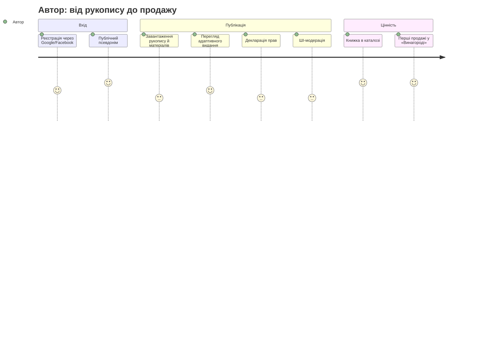

# User Journey

## Source References

- `docs/prd.md` — ролі (розд. 3), FR-AUTH, FR-PUB, FR-MOD, FR-CAT, FR-PAY, FR-LIB, FR-REV, FR-REW, FR-PYT.
- `docs/product-idea.md` — «Основний користувач — автор; покупець є повноцінним другим користувачем»; суть цінності.
- `docs/project-context.md` — спожито: розд. 3–4 (користувачі), розд. 7 (платформа/локалізація), розд. 13 (ризики).
- `docs/canonical-terms.md` — канонічні терміни ролей і обʼєктів.
- `docs/guardrails.md` — рівень ставок consumer/paid; правила доказовості.
- Пряма correction-команда оператора 2026-07-22 — публічний розподіл `35% платформі / 65% автору`; внутрішній менеджерський розклад частки платформи `35 = 29 + 6`; візуальний baseline V3.

## Primary User

Автор (`author`) — україномовний користувач із готовим відредагованим Рукописом, без видавця й без обов'язкових технічних навичок верстки. Покупець (`buyer`) — повноцінний другий користувач із власною повною подорожжю (окремий розділ нижче). Менеджер (`manager`) — операційна роль, не протагоніст.

## Named Protagonist (only if source-backed or user-confirmed; otherwise use the role label)

Not applicable: джерела не називають персону; використовуються рольові мітки «Автор» і «Покупець» (прогалину зафіксовано в Open Questions).

## User Goal

- Автор: перетворити готовий рукопис на електронну книжку, що продається, і прозоро бачити свою винагороду (65% від сплаченої ціни).
- Покупець: знайти українську книжку, купити її за гривні й отримати файли EPUB/MOBI у власній бібліотеці.

## Starting Context

- Автор сідає за ноутбук із готовим DOCX/TXT або документом у Google Docs, має опис, ілюстрації та (можливо) обкладинку. Тригер сесії: рукопис завершено, хочеться продавати без видавця.
- Покупець приходить із пошуку або за прямим посиланням на Сторінку книжки, з desktop чи mobile browser (адаптивний веб, project-context розд. 7). Може переглядати Каталог без входу (FR-AUTH-2).

## Stakes And Constraints

- Платний споживчий продукт: реальні гроші покупців і винагорода авторів (guardrails: consumer/paid).
- Вхід лише через Google/Facebook перед публікацією чи покупкою (FR-AUTH-1/2).
- Публікація зобовʼязує: 5-річна невиключна ліцензія без дострокового зняття (FR-LIC-2/3) — головне довірче рішення автора.
- Мова — українська, валюта — гривня, формати — EPUB/MOBI без внутрішньої читалки (FR-CAT-1, FR-PAY-1, FR-PUB-7).

## Journey Overview

## Journey Stages

### Подорож автора (основна)

1. Автор відкриває UkieBook, реєструється через Google або Facebook (FR-AUTH-1).
2. Задає публічне імʼя або псевдонім, окремий від майбутніх платіжних даних (FR-AUTH-3).
3. Починає публікацію: завантажує рукопис (DOCX/TXT/Google Docs), опис, ілюстрації (FR-PUB-1, FR-PUB-4).
4. Завантажує обкладинку або погоджується на просту згенеровану з шаблону (FR-PUB-5).
5. Вибирає один основний жанр, базову ціну (з підказкою діапазону) і безкоштовний фрагмент (FR-PUB-4, FR-PUB-9).
6. Переглядає Попередній перегляд видання: структуру, Ілюстрації, Обкладинку, опис і вигляд Сторінки книжки (FR-PUB-6). За потреби повертається до кроку 3.
7. Окремо читає й підтверджує Декларацію прав (FR-PUB-8) та наслідки п'ятирічного невиключного права розповсюдження без раннього зняття (FR-LIC-2/3), після чого подає Книжку.
8. Книжка проходить ШІ-модерацію (FR-MOD-1); ризикові випадки чекають ручної перевірки (FR-MOD-2).
9. Книжка зʼявляється в Каталозі — Сторінка книжки доступна.
10. Автор стежить за продажами в розділі «Винагорода»: продажі, нарахування 65%, публічна формула `35% платформі / 65% автору`, статус виплат (FR-REW-5/6).
11. Перед першою виплатою обирає модель ФОП чи фізособа/роялті та подає договірні/платіжні дані (FR-AUTH-4, FR-REW-4).
12. Щомісяця після підтвердження менеджером отримує виплату від 100 грн (FR-PYT-1/3/4).

### Подорож покупця (друга повна)

1. Покупець переглядає каталог без входу; шукає за назвою, автором, жанром чи знижками (FR-AUTH-2, FR-CAT-2).
2. Відкриває сторінку книжки: опис, рейтинг, відгуки, читає безкоштовний фрагмент (FR-CAT-3).
3. Додає одну чи кілька книжок у кошик (FR-PAY-2).
4. Для оплати входить через Google/Facebook (FR-AUTH-2).
5. Оплачує через mono: картка, Apple Pay або Google Pay (FR-PAY-3).
6. Отримує email із переліком книжок і посиланням на бібліотеку (FR-PAY-4).
7. Завантажує EPUB/MOBI з Бібліотеки й може повторно завантажити придбані файли (FR-LIB-1/2).
8. Залишає рейтинг і відгук на куплену книжку; відгук проходить модерацію (FR-REV-1/2).
9. Після оновлення книжки автором отримує останню версію без доплати (FR-LIB-3).

### Підтримувальні та повторні подорожі

1. **Знижка Автора:** Автор відкриває керування Книжкою, задає значення й дати Знижки, бачить запланований/активний/завершений стан; Покупець бачить фактично чинну ціну на Сторінці книжки та в Кошику (FR-CAT-4, FR-REW-3).
2. **Оновлення книжки:** Автор бачить наслідок 250 грн до подання, завантажує оновлений Рукопис або Обкладинку, проходить ШІ-модерацію/Ручну перевірку; після схвалення Бібліотека попереднього Покупця видає останні EPUB/MOBI без доплати (FR-UPD-1..3).
3. **Повернення коштів:** Покупець подає запит із Бібліотеки; Менеджер ухвалює рішення; схвалене Повернення коштів змінює статус для Покупця і створює компенсацію в Нарахуваннях/Таблиці виплат (FR-REF-1..3).
4. **Операції Менеджера:** Менеджер окремими навігаційними гілками опрацьовує Ручну перевірку, Повернення коштів, Таблицю виплат та картку Автора; ці гілки не є послідовними кроками однієї задачі.
5. **Автор-засновник:** Менеджер знаходить Автора, бачить чинного Автора-засновника й через підтвердження переносить або вмикає єдиний спецстатус; Автор не бачить перемикача (FR-FND-1..4).
6. **Дострокове прибирання Книжки:** Менеджер у Ручній перевірці ризикової опублікованої Книжки фіксує підставу порушення й прибирає її з Каталогу; публічна Сторінка книжки переходить у стан «Книжка недоступна» (FR-LIC-4).

## Climax Beat

- Автор: момент, коли після Попереднього перегляду видання і модерації Сторінка книжки стає живою в Каталозі — Рукопис перетворився на товар, який можна показати світові; підсилюється першим рядком продажів у «Винагороді».
- Покупець: файли куплених книжок зʼявляються в бібліотеці одразу після оплати.

## Decision Points

- Автор: завантажити свою обкладинку чи прийняти згенеровану (FR-PUB-5); ціна в межах підказки чи поза нею (FR-PUB-9); який фрагмент зробити безкоштовним; підтвердити декларацію прав і 5-річну ліцензію (FR-PUB-8, FR-LIC-2/3); ФОП чи фізособа/роялті перед першою виплатою (FR-REW-4); чи подавати платне оновлення за 250 грн (FR-UPD-2).
- Покупець: купити одразу чи додати ще книжки в кошик; входити через Google чи Facebook; подавати запит на повернення (FR-REF-1).

## Friction And Risks

- Автор боїться, що конвертація зіпсує текст та Ілюстрації — Попередній перегляд видання є єдиною точкою контролю якості (FR-PUB-6; ризик конвертації — project-context розд. 13).
- Декларація прав і 5-річна ліцензія без дострокового зняття — найбільший довірчий барʼєр (FR-LIC-3); прозора формула `35% платформі / 65% автору` працює на довіру у зворотний бік (FR-REW-2).
- Відхилення модерацією дає лише коротку категорію причини — можливе відчуття непрозорості (FR-MOD-3).
- Ручна перевірка Ризикових випадків і ручні Виплати створюють очікування (project-context розд. 13).
- Покупець без внутрішньої читалки має сам відкрити EPUB/MOBI у сторонньому застосунку (FR-PUB-7) — потенційна точка розгубленості.
- Обовʼязковий вхід через Google/Facebook перед оплатою може зірвати покупку користувачам без цих акаунтів (FR-AUTH-1).

## Failure Path

- Автор: ШІ-модерація позначає Книжку → Ручна перевірка → відхилення з Категорією причини; Автор виправляє матеріали й подає знову, або йде з платформи. Незадовільний Попередній перегляд видання → повернення до завантаження без подання. Неприйнята Декларація прав або ліцензійна умова → подання заблоковане без втрати чернетки.
- Покупець: невдала оплата mono → кошик зберігається, повторна спроба; книжка не відкривається в читалці → повторне завантаження з бібліотеки (FR-LIB-2) або запит на повернення (FR-REF-1).

## Exit Points

- Автор: після Попереднього перегляду видання (розчарування конвертацією); на підтвердженнях прав/ліцензії; після відхилення модерацією.
- Покупець: на вимозі входу перед оплатою; на екрані оплати mono; після покупки — природне завершення сесії з email-посиланням на бібліотеку.

## Success State

- Автор: книжка опублікована в каталозі, продається, нарахування зростають, щомісячні виплати надходять після підтвердження менеджером.
- Покупець: книжки в бібліотеці, файли завантажені й читаються, відгук опубліковано; оновлення приходять безкоштовно.

## Confirmed Facts And Constraints

- Автор — основний користувач; покупець — повноцінний другий (product-idea «Межі MVP»).
- Гостьовий перегляд каталогу без входу; вхід обовʼязковий для публікації та покупки (FR-AUTH-2, припущення A-4).
- Публічна формула `35% платформі / 65% автору`; для менеджерських розрахунків `35% = 29% чистого заробітку платформи + 6% податкового компонента платформи`; інваріант `29 + 6 + 65 = 100`. Мінімальна виплата 100 грн; місячні виплати з ручним підтвердженням (FR-REW-2, FR-PYT-1/3/4).
- Кошик на кілька книжок; оплата mono (картка, Apple Pay, Google Pay); email після покупки (FR-PAY-2/3/4).
- Відгуки — лише від підтверджених покупців, після модерації (FR-REV-1/2).

## Open Questions

- OQ-UJ1. Іменована персона протагоніста відсутня в джерелах — рольові мітки використано свідомо (неблокувально; за бажання оператор може назвати персону).
- OQ-UJ2. Чи потрібна підказка/інструкція покупцеві, як відкрити EPUB/MOBI без внутрішньої читалки? Джерела не визначають; рекомендований дефолт — коротка довідка в бібліотеці (вирішується на рівні screen-map/wireframes, неблокувально).
